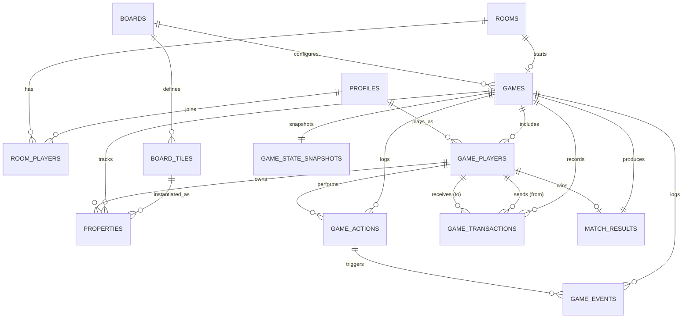

# CoBacTyPhu — Database Design

Design only — no migrations, no SQL run against any database. Source of truth for schema; `GAME_DESIGN_SPEC.md`, `BOARD_SPECIFICATION.md`/`ADAPTIVE_BOARD_DESIGN.md`, `GAME_STATE_MACHINE.md`, and `ECONOMY_SPECIFICATION.md` are the only gameplay inputs used. Same tagging convention: **[CONFIRMED]**, **[PROPOSED]**, **[OPEN DESIGN DECISION]**.

Two prior decisions are revised here, both explained where they occur, not silently changed:
- `ADAPTIVE_BOARD_DESIGN.md` said board layout is "static backend config, not a database table." This document puts it in Postgres instead, per your explicit ask for `Boards`/`Board Tiles` entities — see §6/§7 below for why that doesn't reopen the security concern the original decision was protecting.
- `GAME_DESIGN_SPEC.md` §10's `LedgerEntry` (signed `amount` + nullable `counterpartyId`) is refined into an always-positive, always-two-sided `from`/`to` shape in §12 — a stronger integrity property, explained there.

---

## Persistent vs. ephemeral — the load-bearing distinction

Everything below is **persistent** (Postgres). It is explicitly *not* where live gameplay state lives while a match is being played — that's still in-memory on the Node backend, per the architecture doc and `GAME_STATE_MACHINE.md` §7 (timers, current phase mid-resolution, pending trade/auction offers, socket connection status). Three concrete things are deliberately **excluded** from this schema because they're ephemeral by nature and gain nothing from durability:

- **Connection status** (`connected`/AFK flags). Meaningless at rest — on a server restart, every player is "disconnected" until their socket reconnects, regardless of what a stale column said. Tracked only in memory.
- **Turn timer deadlines** (`deadlineAt` values, `GAME_STATE_MACHINE.md` §7). A restored deadline from before a restart or pause is meaningless — recovery always issues a fresh one.
- **Flash Auction bidding state, mid-auction**. Lives in memory for the duration of `FLASH_AUCTION_ACTIVE` only. Its *outcome* is what gets persisted — one `game_transactions` row and one `game_events` row once it settles (§11/§12). There is no `auctions` table, even though "auctions" was in your requirements list — this is a deliberate example of the ephemeral/persistent split, not an omission.

Your instruction not to dump everything into one `game_state` JSON is followed throughout — ownership, transactions, actions, and events are all normalized into their own queryable tables. **One JSONB column is kept anyway** (`game_state_snapshots.state`, §9), for a reason explained there rather than assumed.

---

## Table of contents

1. `profiles` (Users) · 2. `rooms` · 3. `room_players` · 4. `games` · 5. `game_players` · 6. `boards` · 7. `board_tiles` · 8. `properties` · 9. `game_state_snapshots` (Game State) · 10. `game_actions` · 11. `game_events` · 12. `game_transactions` · 13. `match_results` · then ERD, index/RLS/transaction strategy, data lifecycle, critical-requirements mapping, open decisions.

---

## 1. `profiles` (Users)

Extends Supabase's built-in `auth.users` — never duplicated, only extended, per standard Supabase practice.

| Column | Type | PK/FK | Nullable | Default | Constraints |
|---|---|---|---|---|---|
| `id` | uuid | PK, FK → `auth.users(id)` | no | — | — |
| `display_name` | text | | no | set by trigger from auth metadata on signup | `length(display_name) BETWEEN 1 AND 40` |
| `avatar_url` | text | | yes | null | — |
| `created_at` | timestamptz | | no | `now()` | — |

**Indexes**: PK only — this table is always looked up by `id`.
**Standard Supabase pattern** (design note, not implementation): a trigger on `auth.users` insert creates the matching `profiles` row — the client never inserts here directly.

---

## 2. `rooms`

| Column | Type | PK/FK | Nullable | Default | Constraints |
|---|---|---|---|---|---|
| `id` | uuid | PK | no | `gen_random_uuid()` | — |
| `join_code` | text | | no | — | `length(join_code) = ROOM_JOIN_CODE_LENGTH` |
| `host_id` | uuid | FK → `profiles(id)` | no | — | — |
| `status` | text | | no | `'waiting_for_players'` | `CHECK (status IN ('waiting_for_players','ready_check','starting','in_progress','abandoned'))` |
| `created_at` | timestamptz | | no | `now()` | — |
| `updated_at` | timestamptz | | no | `now()` | bumped by trigger on update |

No `max_players` column — `GAME_DESIGN_SPEC.md` §0's `MAX_PLAYERS = 6` is a fixed system constant, not a per-room setting (`ADAPTIVE_BOARD_DESIGN.md` §"Board-size selection" already confirmed no host override exists); adding a column for a value that never varies would be speculative.

**Indexes**:
- `UNIQUE (join_code) WHERE status <> 'abandoned'` — a **partial** unique index, not a plain one. Lets a join code be reused once its room is done, instead of the codespace only ever growing.
- `(host_id)` — "my rooms" lookups.
- `(status)` — the idle-room cleanup job (`LOBBY_IDLE_TIMEOUT_MINUTES`) scans by status.

---

## 3. `room_players`

| Column | Type | PK/FK | Nullable | Default | Constraints |
|---|---|---|---|---|---|
| `room_id` | uuid | PK (composite), FK → `rooms(id)` `ON DELETE CASCADE` | no | — | — |
| `player_id` | uuid | PK (composite), FK → `profiles(id)` | no | — | — |
| `is_ready` | boolean | | no | `false` | — |
| `joined_at` | timestamptz | | no | `now()` | — |

Composite PK `(room_id, player_id)` prevents duplicate membership by construction — no separate uniqueness check needed. The 2–6 player cap is enforced at the application layer (the backend already validates it, `GAME_DESIGN_SPEC.md` §4) rather than a DB trigger — a row-count-across-siblings check needs a trigger either way, and the backend is already the authoritative gate; a DB-level copy would be pure defense-in-depth, not a base requirement.

**Indexes**: `(player_id)` — reconnect needs "which room is this user currently in" fast, independent of `room_id`.

---

## 4. `games`

| Column | Type | PK/FK | Nullable | Default | Constraints |
|---|---|---|---|---|---|
| `id` | uuid | PK | no | `gen_random_uuid()` | — |
| `room_id` | uuid | FK → `rooms(id)` | no | — | `UNIQUE` — one game per room (no rematch flow designed yet — scope note, not an omission) |
| `board_id` | text | FK → `boards(id)` | no | — | set once, at `STARTING`, by the auto-selection rule |
| `status` | text | | no | `'in_progress'` | `CHECK (status IN ('in_progress','ending','finished','aborted'))` |
| `current_turn_index` | smallint | | no | `0` | denormalized, snapshot-cadence — see note below |
| `state_version` | bigint | | no | `0` | persisted at snapshot time (`GAME_STATE_MACHINE.md` §9) so recovery resumes the counter correctly |
| `started_at` | timestamptz | | no | `now()` | — |
| `ended_at` | timestamptz | | yes | null | set when status becomes `finished`/`aborted` |

**On `current_turn_index` (and similarly several `game_players` columns below)**: these are *not* updated on every single action — they're refreshed at the same cadence as `game_state_snapshots` (after every `TurnEnd`, plus bankruptcy/game-over, per `GAME_STATE_MACHINE.md` §0 `SNAPSHOT_TRIGGER`). While a game is actively running, the true live value is in Node memory; these columns are "as of last snapshot," useful for anyone querying the DB directly (an admin view, a reconnect fallback) without needing the live process. This keeps per-action DB writes to exactly what already has to be written anyway (the action/event/transaction log rows) rather than adding an update on every roll and rent payment.

**Indexes**: `(status)` — server-restart recovery queries `WHERE status = 'in_progress'` (`GAME_DESIGN_SPEC.md` §20/`GAME_STATE_MACHINE.md` §9).

---

## 5. `game_players`

Includes a **Bank sentinel row per game** — see §12 for why.

| Column | Type | PK/FK | Nullable | Default | Constraints |
|---|---|---|---|---|---|
| `id` | uuid | PK | no | `gen_random_uuid()` | surrogate PK — other tables FK to this, not to a composite |
| `game_id` | uuid | FK → `games(id)` `ON DELETE CASCADE` | no | — | — |
| `player_id` | uuid | FK → `profiles(id)` | yes | — | null **only** for the Bank sentinel row |
| `is_bank` | boolean | | no | `false` | `CHECK ((is_bank AND player_id IS NULL) OR (NOT is_bank AND player_id IS NOT NULL))` |
| `turn_order` | smallint | | yes | — | null for the Bank row; shuffled 0-indexed order for real players |
| `starting_balance` | integer | | yes | — | null for the Bank row; snapshot of `STARTING_BALANCE` *at the time this game began* — later parameter tuning must never retroactively rewrite a finished game's record |
| `current_balance` | integer | | no | = `starting_balance` (or `BANK_RESERVE_INITIAL` for the Bank row) | `CHECK (current_balance >= 0 OR is_bank)` — only the Bank may go negative (`ECONOMY_SPECIFICATION.md` §0); denormalized, snapshot-cadence, same reasoning as `games.current_turn_index` — true source of truth is always `Σ game_transactions` for this row (§12) |
| `current_position` | smallint | | yes | `0` | null for the Bank row; denormalized, snapshot-cadence |
| `in_jail` | boolean | | yes | `false` | null for the Bank row |
| `jail_turns` | smallint | | yes | `0` | null for the Bank row |
| `bankrupt` | boolean | | yes | `false` | null for the Bank row — the Bank cannot go bankrupt (`ECONOMY_SPECIFICATION.md` §0) |
| `bankrupt_at` | timestamptz | | yes | null | for match-history ranking (`GAME_DESIGN_SPEC.md` §22) |
| `final_rank` | smallint | | yes | null | set at match end; 1 = winner |

Unique constraint: `UNIQUE (game_id, player_id) WHERE NOT is_bank` — a real player appears once per game; the Bank row is exempt (its `player_id` is null, so it wouldn't collide anyway, but the partial index makes the intent explicit).

No `connected`/`is_afk` columns — ephemeral, per the section above.

**Indexes**: `(player_id)` — "my match history" (`/api/players/me/history`). `(game_id, turn_order)` — turn-order queries.

---

## 6. `boards`

**[REVISES `ADAPTIVE_BOARD_DESIGN.md`]** — now a small, fixed reference table rather than backend-only config, per your explicit ask for a `Boards` entity. Only ever 2 rows (`small`, `large`) — seed data, not something written to at runtime. A semantic text PK fits a fixed lookup table better than a UUID here.

| Column | Type | PK/FK | Nullable | Default | Constraints |
|---|---|---|---|---|---|
| `id` | text | PK | no | — | `CHECK (id IN ('small','large'))` |
| `name` | text | | no | — | — |
| `tile_count` | smallint | | no | — | `CHECK (tile_count IN (36, 44))` — the approved values, `ADAPTIVE_BOARD_DESIGN.md` |
| `min_players` | smallint | | no | — | — |
| `max_players` | smallint | | no | — | — |
| `created_at` | timestamptz | | no | `now()` | — |

**Why moving this into Postgres doesn't reopen the original security concern**: `ADAPTIVE_BOARD_DESIGN.md`'s reasoning for keeping board data out of a database was "it can't be tampered with per-request because it's never read per-request from anywhere client-reachable." A Postgres table with no client write policy (§"RLS strategy" below — only `service_role` writes it) preserves that exact property — clients still can't tamper with it, they just now read it from a table instead of a bundled config file. What's gained: it can be edited/versioned/localized without a backend redeploy.

**Indexes**: none beyond the PK — 2 rows, always read in full.

---

## 7. `board_tiles`

Static per-board reference data — the tile *type system*, not live ownership (that's §8).

| Column | Type | PK/FK | Nullable | Default | Constraints |
|---|---|---|---|---|---|
| `id` | uuid | PK | no | `gen_random_uuid()` | — |
| `board_id` | text | FK → `boards(id)` | no | — | — |
| `position` | smallint | | no | — | `UNIQUE (board_id, position)` |
| `tile_type` | text | | no | — | `CHECK (tile_type IN ('go','property','transport','utility','chance','fortune','tax','jail','free_parking','go_to_jail'))` |
| `name` | text | | no | — | — |
| `group_id` | text | | yes | null | color/group tag — still unpopulated pending `BOARD_SPECIFICATION.md` §15's open item on whether this board even has groups |
| `price` | integer | | yes | null | property/transport/utility tiles only |
| `base_rent` | integer | | yes | null | property/transport/utility tiles only |
| `rent_table` | jsonb | | yes | null | per-upgrade-level rent array (0–4 houses + hotel) — see justification below |
| `house_cost` | integer | | yes | null | property tiles only |
| `mortgage_value` | integer | | yes | null | property/transport/utility tiles only |
| `tax_amount` | integer | | yes | null | tax tiles only |

**Why `rent_table` is JSONB and nothing else here is**: it's a small, fixed-shape array that is always read as a whole (there's no query that ever needs "just the 2-house rent value across every tile") and never joined against. That's the "strong reason" your instruction asks for. Everything else on this row is a scalar that a real query might filter or sort on (`price`, `tax_amount`), so those stay as normal columns rather than being folded into the same blob.

Many nullable, type-specific columns on one row (rather than a table per tile type) is an acceptable trade at this scale — a handful of columns, a small reference table, no complex type-specific querying. Would reconsider if this table grew significantly wider.

**Indexes**: `UNIQUE (board_id, position)` already covers the main access pattern ("tile N of board X").

---

## 8. `properties`

Per-**game** dynamic ownership — one row per property-type tile, created for every property/transport/utility `board_tiles` row on the selected board the moment a game reaches `STARTING`, all starting `owner_id = null`.

| Column | Type | PK/FK | Nullable | Default | Constraints |
|---|---|---|---|---|---|
| `id` | uuid | PK | no | `gen_random_uuid()` | — |
| `game_id` | uuid | FK → `games(id)` `ON DELETE CASCADE` | no | — | — |
| `board_tile_id` | uuid | FK → `board_tiles(id)` | no | — | `UNIQUE (game_id, board_tile_id)` |
| `owner_id` | uuid | FK → `game_players(id)` | yes | null | null = bank/unowned |
| `upgrade_level` | smallint | | no | `0` | `CHECK (upgrade_level BETWEEN 0 AND 5)` |
| `mortgaged` | boolean | | no | `false` | — |
| `acquired_at` | timestamptz | | yes | null | set on purchase/acquisition, cleared on return-to-bank |

**Written live, not at snapshot cadence — a deliberate asymmetry with `game_players.current_balance`**: ownership changes far less often than balance does (only on purchase/mortgage/upgrade/trade/bankruptcy-transfer, versus balance moving on every single rent/tax/salary event). Keeping this table always-current is cheap at that frequency and pays for itself: it makes "does player X own the whole color group" (needed for the monopoly-bonus rule, `ECONOMY_SPECIFICATION.md` §2) a plain query instead of a replay, and gives a real-time-accurate board-ownership view queryable directly from Postgres. **This does not reintroduce Supabase Realtime as a gameplay sync channel** — that was already decided against (architecture doc: Socket.IO owns 100% of live sync). Writing here live is for durability/queryability only; clients still only ever learn about ownership changes via `game:state_update`.

**Indexes**: `(owner_id)` — group-ownership checks, "how many properties does player X hold."

---

## 9. `game_state_snapshots` (Game State)

The **one** deliberate JSONB-blob table — and the reason it's fine here specifically, unlike everywhere else.

| Column | Type | PK/FK | Nullable | Default | Constraints |
|---|---|---|---|---|---|
| `game_id` | uuid | PK, FK → `games(id)` `ON DELETE CASCADE` | no | — | one row per game — see below |
| `state` | jsonb | | no | — | full in-memory `GameState` (`GAME_DESIGN_SPEC.md` §2), **excluding** connection flags and timer deadlines (§ ephemeral note above) |
| `reason` | text | | no | — | `CHECK (reason IN ('turn_end','bankruptcy','game_over'))` — matches `SNAPSHOT_TRIGGER` |
| `created_at` | timestamptz | | no | `now()` | overwritten on every snapshot, not accumulated |

**Why one JSONB blob is right here and nowhere else in this schema**: this table has exactly one consumer and one access pattern — "load the entire thing back into memory after a restart." Nothing ever queries a sub-field, filters by a nested value, or joins against it. Normalizing it into ownership/position/phase tables would just be `properties`, `game_players`, and a phase enum *again*, duplicating data that's already normalized elsewhere, purely so the recovery path could reassemble something a single JSONB read already gives it directly. That's the inverse of your instruction, not a violation of it.

**One row per game, not many**: `game_id` is the PK. A new snapshot is an `UPSERT` (`INSERT ... ON CONFLICT (game_id) DO UPDATE`), not an insert — recovery only ever needs the *latest* snapshot, and the full action/event/transaction logs (§10–§12) already provide replayable history if deeper forensic detail is ever needed. This also means the table is self-bounding — no retention job required. **[Flagged, not fully confident]**: if you specifically want historical snapshots retained (not just the latest) for deeper debugging, this would need to change to a normal growing table with an index on `(game_id, created_at DESC)` instead — noting it since it's a real trade-off, not an obvious default.

**Indexes**: PK on `game_id` already serves the only query this table gets.

---

## 10. `game_actions`

The technical audit trail *and* the idempotency backstop — `GAME_STATE_MACHINE.md` §6's in-memory dedup cache is short-lived; this table gives it a durable one.

| Column | Type | PK/FK | Nullable | Default | Constraints |
|---|---|---|---|---|---|
| `id` | uuid | PK | no | `gen_random_uuid()` | — |
| `game_id` | uuid | FK → `games(id)` `ON DELETE CASCADE` | no | — | — |
| `player_id` | uuid | FK → `game_players(id)` | yes | null | null for system-triggered actions (timeouts, auto-rolls) |
| `client_action_id` | uuid | | yes | null | client-generated idempotency key; null for system actions |
| `state_version` | bigint | | no | — | the version this action produced |
| `action_type` | text | | no | — | e.g. `roll_dice`, `buy_property`, `end_turn` |
| `payload` | jsonb | | yes | null | action-specific parameters (e.g. `{tileIndex}`) — small, variable-shaped, always read whole: same justification pattern as `rent_table` |
| `created_at` | timestamptz | | no | `now()` | — |

**Indexes**:
- `UNIQUE (game_id, state_version)` — enforces the monotonic-counter invariant at the DB level too, not just in application logic.
- `UNIQUE (game_id, client_action_id) WHERE client_action_id IS NOT NULL` — the durable idempotency backstop described above: even if the backend's in-memory cache missed a duplicate (say, right after a restart wiped it), the database itself refuses a second row for the same `client_action_id`.
- `(game_id, created_at)` — chronological audit queries.

---

## 11. `game_events`

The narrative/notable-occurrence log — a curated subset of what happens, distinct from `game_actions`' exhaustive technical log. Card draws, bankruptcies, auctions settling, hostile acquisitions resolving, eliminations, game-over — the things worth showing in an activity feed or a post-game recap, not every single dice roll.

| Column | Type | PK/FK | Nullable | Default | Constraints |
|---|---|---|---|---|---|
| `id` | uuid | PK | no | `gen_random_uuid()` | — |
| `game_id` | uuid | FK → `games(id)` `ON DELETE CASCADE` | no | — | — |
| `triggered_by_action_id` | uuid | FK → `game_actions(id)` | yes | null | which action (if any) caused this event |
| `event_type` | text | | no | — | e.g. `card_drawn`, `bankruptcy`, `flash_auction_settled`, `hostile_acquisition_resolved`, `player_eliminated`, `game_over` |
| `player_id` | uuid | FK → `game_players(id)` | yes | null | the player most associated with this event, where applicable |
| `details` | jsonb | | yes | null | event-specific narrative data (e.g. drawn card text) |
| `created_at` | timestamptz | | no | `now()` | — |

**Indexes**: `(game_id, created_at)` — the activity-feed query is always "this game's events, in order."

---

## 12. `game_transactions`

Refines `GAME_DESIGN_SPEC.md` §10/§21's `LedgerEntry`. The original shape used a signed `amount` on one player row plus a nullable `counterpartyId`. Here, **every row names both parties explicitly and `amount` is always positive** — a stronger integrity property: it's structurally impossible to write a transaction that isn't a transfer, which makes `ECONOMY_SPECIFICATION.md` §4's invariant provable by the schema itself, not just by convention. This is also what the Bank sentinel row in `game_players` (§5) is for — `from`/`to` can always be a real, `NOT NULL` FK, never a special-cased null meaning "the bank."

| Column | Type | PK/FK | Nullable | Default | Constraints |
|---|---|---|---|---|---|
| `id` | uuid | PK | no | `gen_random_uuid()` | — |
| `game_id` | uuid | FK → `games(id)` `ON DELETE CASCADE` | no | — | — |
| `from_game_player_id` | uuid | FK → `game_players(id)` | no | — | `CHECK (from_game_player_id <> to_game_player_id)` |
| `to_game_player_id` | uuid | FK → `game_players(id)` | no | — | — |
| `amount` | integer | | no | — | `CHECK (amount > 0)` — direction is `from`/`to`, never sign |
| `transaction_type` | text | | no | — | `initial_balance \| purchase \| rent \| pass_go_salary \| tax \| event_card \| jail_fine \| build \| sell_house \| mortgage \| unmortgage \| trade \| flash_auction \| hostile_acquisition \| rent_gamble \| bankruptcy_transfer` |
| `idempotency_key` | text | | no | — | `${gameId}:${stateVersion}` (`GAME_STATE_MACHINE.md` §6) |
| `resulting_balance_from` | integer | | yes | null | denormalized audit convenience — computed by the backend at write time, not a second source of truth (true balance is always `Σ` this table, §5) |
| `resulting_balance_to` | integer | | yes | null | same |
| `created_at` | timestamptz | | no | `now()` | — |

**Indexes**:
- `UNIQUE (idempotency_key)` — the ultimate backstop for the whole idempotency chain (client dedup → `stateVersion` staleness check → this).
- `(game_id, created_at)` — chronological ledger view.
- `(from_game_player_id)`, `(to_game_player_id)` — per-player transaction history.

---

## 13. `match_results`

Deliberately **not** a `standings` JSONB blob — that data already lives properly normalized in `game_players` (`final_rank`, `current_balance`, `bankrupt_at`, §5). This table only needs to record the outcome itself; per-player standings come from `SELECT * FROM game_players WHERE game_id = $1 ORDER BY final_rank`. Worth naming explicitly: this is a case where reaching for JSONB was the *wrong* instinct — the data was already relational.

| Column | Type | PK/FK | Nullable | Default | Constraints |
|---|---|---|---|---|---|
| `id` | uuid | PK | no | `gen_random_uuid()` | — |
| `game_id` | uuid | FK → `games(id)` | no | — | `UNIQUE` |
| `result_type` | text | | no | — | `CHECK (result_type IN ('elimination_win','net_worth_win','aborted'))` — matches `GAME_DESIGN_SPEC.md` §17's still-open win-condition alternatives |
| `winner_game_player_id` | uuid | FK → `game_players(id)` | yes | null | null if `aborted` |
| `ended_at` | timestamptz | | no | `now()` | — |

**Indexes**: none beyond the FKs — this table is always looked up by `game_id`, already unique.

---

## ERD

Relationships only — attributes are in the tables above; repeating them inside the diagram at 13 entities would make it unreadable rather than clearer.

## Table relationship explanation

`rooms` and `games` are 1:1 by design — a room's lobby phase and its match phase are the same underlying "thing" at different points in `GAME_STATE_MACHINE.md` §1's lifecycle, just split into two tables because their columns genuinely differ (lobby settings vs. match progress) and because `room_players` (pre-game roster) and `game_players` (in-match economic actors, including the Bank sentinel) are different-shaped concepts even though they usually contain the same humans. `board_tiles` is board-config-scoped (shared across every game that uses that board), while `properties` is game-scoped (one fresh ownership row per game) — this is the split that lets two different games on the same board configuration have completely independent ownership without any risk of one game's purchase leaking into another's. `game_actions` and `game_events` are both append-only logs of the same underlying match, but at different resolutions: actions are exhaustive and technical (idempotency-bearing), events are curated and narrative (activity-feed-bearing) — one action can produce zero, one, or several events.

## Index strategy

- **Every foreign key gets an index.** Postgres does not create one automatically for FK columns — worth stating explicitly since it's the most common real-world miss in a schema like this.
- **Uniqueness constraints do double duty** as the indexes protecting the three integrity-critical paths in this whole design: `rooms.join_code` (partial), `game_actions.client_action_id` (partial), `game_transactions.idempotency_key`.
- **Composite indexes match actual query shapes**, not speculative ones: `(game_id, created_at)` appears on every log table because "this game's log, in order" is the only way any of them are ever read.
- **Small, fixed reference tables (`boards`, `board_tiles`) are deliberately under-indexed** beyond their natural unique constraints — a handful of rows, always read in full or by exact position, gain nothing from more.

## RLS strategy

**The core stance: RLS here is a read-side gate and a defense-in-depth backstop, not the primary write-authorization mechanism.** The primary authorization is the backend's own server-authoritative validation, already fully specified (`GAME_DESIGN_SPEC.md` §27, `GAME_STATE_MACHINE.md` throughout). The backend writes every gameplay-relevant row using the `service_role` key, which bypasses RLS by design — that's intentional, not a gap, because the alternative (letting authenticated clients write directly to `game_transactions`/`properties`/etc. under an RLS policy trying to replicate all the same-turn/solvency/ownership checks the backend already does in code) would mean maintaining the entire rule set twice, in two languages, with two chances to drift apart.

Concretely:
- **No `INSERT`/`UPDATE`/`DELETE` policies for the `authenticated` role on**: `rooms`, `room_players` (ready-toggle goes through the backend's REST API, `API_CONTRACT.md`, not a direct write), `games`, `game_players`, `boards`, `board_tiles`, `properties`, `game_state_snapshots`, `game_actions`, `game_events`, `game_transactions`, `match_results`. All writes to these are `service_role` only.
- **One deliberate exception**: `profiles` — a user may `UPDATE` their own row (`auth.uid() = id`) for `display_name`/`avatar_url`. This isn't gameplay state, just a preference, and there's no reason to route it through the backend.
- **`SELECT` policies exist on every table**, scoped to membership: a user can read `rooms`/`room_players`/`games`/`game_players`/`properties`/`game_actions`/`game_events`/`game_transactions`/`match_results` rows for rooms/games they belong to — checked via an `EXISTS` subquery against `room_players`/`game_players` matching `auth.uid()`. `boards`/`board_tiles` are readable by any authenticated user (not secret, needed to render any board).
- **Joining a room by code is deliberately *not* a client-side RLS-gated read.** `POST /api/rooms/:code/resolve` (architecture doc §13) goes through the backend using `service_role`. Letting `authenticated` clients query `rooms` by `join_code` directly would mean any logged-in user could enumerate/probe room codes against a client-readable table — routing it through the backend avoids that without needing a cleverer policy.

## Transaction strategy

Where a single Postgres statement is already atomic by construction, no explicit `BEGIN`/`COMMIT` is needed — this is one of the real payoffs of §12's `from`/`to` shape: **one row is one complete, atomic money movement.** A traditional two-row double-entry ledger (a debit row and a credit row) would need a wrapping transaction to guarantee both land together; this schema doesn't have that problem because there's only ever one row per transfer.

**Genuinely multi-statement operations that do need `BEGIN`/`COMMIT`**:
- **Bankruptcy settlement** (`ECONOMY_SPECIFICATION.md` §5): one or more `game_transactions` rows (asset liquidation, debt payment), several `properties.owner_id` reassignments, and a `game_players.bankrupt = true` update — all must land together or not at all, since a partial application would leave properties transferred without the corresponding debt actually settled.
- **Game start** (`STARTING`): inserting `game_players` rows (including the Bank sentinel), the initial `game_transactions` deal (§3's row 1 pattern from `ECONOMY_SPECIFICATION.md` §9), and the initial `properties` rows for every ownable tile — one transaction, so a game is never left half-initialized if something fails partway through.
- **Match settlement** (`GAME_ENDING`): `match_results` insert + `game_players.final_rank`/`bankrupt_at` updates together.

## Data lifecycle

- **`rooms`/`room_players` that never reach `in_progress`** (abandoned lobbies): left in place with `status = 'abandoned'`, not deleted — low volume, low storage cost, and a hard-delete job is unneeded complexity for the MVP. Revisit if room volume ever makes this a real storage concern.
- **`games` and everything under it are permanent** once created — this *is* the match history the product needs (`/api/players/me/history`, architecture doc §13).
- **`game_state_snapshots` is self-bounding** (upsert, one row per game, §9) — no cleanup job needed.
- **`game_transactions`/`game_actions`/`game_events` are never deleted** — they're the audit trail `ECONOMY_SPECIFICATION.md` §7 and `GAME_DESIGN_SPEC.md` §28 depend on existing.

## How this schema satisfies the critical requirements

| Requirement | Where |
|---|---|
| Idempotency | `game_actions.client_action_id` (partial unique) + `game_transactions.idempotency_key` (unique) — two layers, §10/§12 |
| Concurrent actions | Not a schema concern by itself — relies on `GAME_STATE_MACHINE.md` §5's synchronous per-room mutation; the schema's job is just to make a double-write structurally rejected if that guarantee is ever violated (the two unique constraints above) |
| Transaction safety | `from`/`to` atomic-by-construction transfers (§12) + explicit multi-statement transactions where genuinely needed (§ Transaction strategy) |
| Reconnection | `game_players.player_id` is a stable identity FK, matched on reconnect exactly as `GAME_DESIGN_SPEC.md` §23 specifies — never a session/socket id |
| Game recovery | `game_state_snapshots` (§9) + `games.state_version` persisted for counter continuity |
| Auditability | `game_actions` (technical) + `game_events` (narrative) + `game_transactions` (money) — three complementary logs, §10–§12 |
| RLS | § RLS strategy — read-gated by membership, write-gated to `service_role` only, one narrow exception |
| Server-authoritative gameplay | No client write policies on any gameplay table (§ RLS strategy) — the database enforces this the same way the Socket.IO layer does |

---

## Decisions requiring your approval

1. Moving `boards`/`board_tiles` into Postgres (§6/§7) — revises `ADAPTIVE_BOARD_DESIGN.md`'s "static config" call. Flagging in case that revision wasn't intended and board data should stay backend-only after all.
2. `game_state_snapshots` keeping only the latest snapshot per game (upsert) rather than full history — a real trade-off between simplicity and deeper post-hoc debugging capability (§9).
3. `game_transactions`' `from`/`to` shape superseding `GAME_DESIGN_SPEC.md` §10's signed-amount `LedgerEntry` — a stronger integrity property, but a real shape change worth explicit sign-off since it touches the economy spec's core data model.
4. TEXT + `CHECK` constraints instead of native Postgres `ENUM` types throughout (`status`, `tile_type`, `transaction_type`, etc.) — chosen for schema-evolution flexibility while gameplay rules are still being finalized across the other four documents; native enums would be more rigid but slightly more self-documenting.
