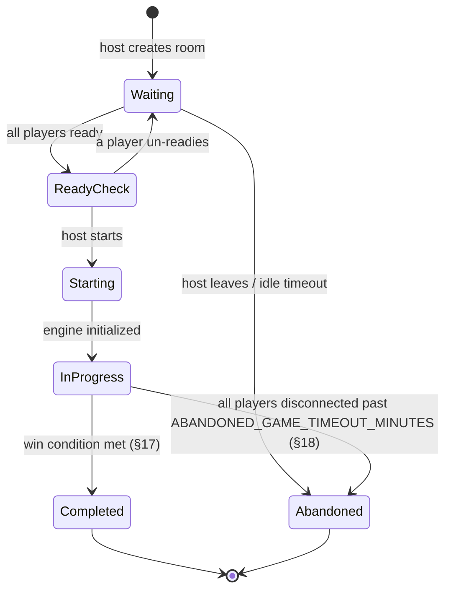
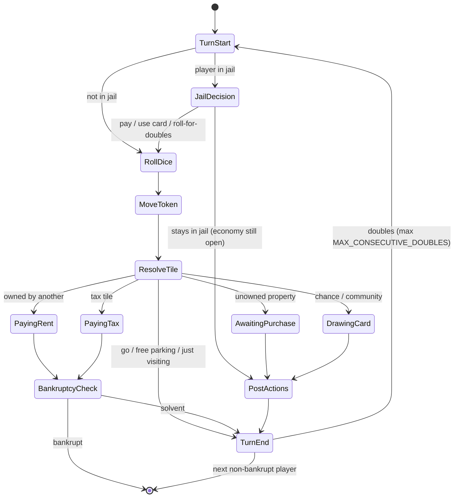

# CoBacTyPhu — Game Design Specification

Source of truth for implementation. Supersedes prose descriptions in chat — if code and this document disagree, this document is right until it's edited.

**Status legend**, used throughout:
- **[CONFIRMED]** — stated explicitly by you, or a direct logical consequence of something you stated (e.g. "server generates dice results" follows from "client must never determine dice results").
- **[PROPOSED]** — a recommendation, usually following classic Monopoly convention or the architecture doc from the previous step. Not yet approved. Change it and this doc changes with it.
- **[OPEN DESIGN DECISION]** — genuinely undecided. Needs your call before it can be implemented as anything but a guess.

No numeric value in this document is final unless its row in §0 is tagged CONFIRMED.

---

## 0. Parameter reference

Every tunable number used anywhere below is defined once here and referenced by name elsewhere, so there's exactly one place to change a value and no risk of two sections quietly disagreeing.

| Name | Proposed value | Status | Rationale |
|---|---|---|---|
| `MIN_PLAYERS` | 2 | **CONFIRMED** | stated requirement |
| `MAX_PLAYERS` | 6 | **CONFIRMED** | stated requirement |
| `BOARD_TILE_COUNT` | ~~40~~ superseded | — | replaced by per-size counts in `ADAPTIVE_BOARD_DESIGN.md` §0 (`SMALL_BOARD_TILE_COUNT`, `LARGE_BOARD_TILE_COUNT`) |
| `STARTING_BALANCE` | 1500 | PROPOSED | classic value |
| `PASS_GO_SALARY` | 200 | PROPOSED | classic value |
| `JAIL_FINE` | 50 | PROPOSED | classic value |
| `MAX_JAIL_TURNS` | 3 | PROPOSED | classic — must pay or leave by the 3rd attempt |
| `MAX_CONSECUTIVE_DOUBLES` | 2 (a 3rd send you to jail) | PROPOSED | classic rule |
| `HOUSE_SUPPLY_TOTAL` | 32 | **CONFIRMED**, Phase 14 (2026-08-19) | classic physical set — §12's scarcity-enforced-or-not OPEN item is resolved: enforced. `BUILD_HOUSE` rejects with `INSUFFICIENT_SUPPLY` once exhausted |
| `HOTEL_SUPPLY_TOTAL` | 12 | **CONFIRMED**, Phase 14 (2026-08-19) | classic physical set, same resolution as above |
| `HOSTILE_BUYOUT_MULTIPLIER` | 2.0 | **CONFIRMED**, Phase 14 (2026-08-19) | new — see §12a. Applies to current property value (price + upgradeLevel × houseCost), not a discount off price alone |
| `ROOM_JOIN_CODE_LENGTH` | 6 chars, excludes `0/O/1/I` | PROPOSED | from architecture doc |
| `LOBBY_IDLE_TIMEOUT_MINUTES` | 30 | PROPOSED | from architecture doc |
| `RECONNECT_GRACE_SECONDS` | 90 | **[SUPERSEDED]**, 2026-08-21 | a standalone 90s disconnect timer was never built as its own mechanism — instead the one real gap that made it necessary (`TURN_START` had no phase timer at all, so a player disconnecting at the exact start of their turn could stall the match forever) was closed by extending the existing per-phase timer system (`stateMachine/timers.js`) to also cover `TURN_START` (15s, defaults to `START_TURN`). Every phase now has its own timer ≤ 45s, all shorter than 90s and all already enforced "regardless of connection status" (§5) — a separate 90s timer would be strictly slower and redundant, not a missing piece |
| `AFK_THRESHOLD_MISSED_TURNS` | 3 consecutive | **[CONFIRMED, partially wired]**, 2026-08-21 | `PlayerGameState.missedTurnStreak` tracks this — incremented when a player's own `POST_ACTIONS→END_TURN` was system-synthesized (a timeout, not a real click), reset on a genuine `END_TURN`. **Narrower than §25's full text**: only the dominant `POST_ACTIONS` timeout path increments it (a rarer synthesized turn-ender — a forced 3rd jail-roll failure, a 3rd-consecutive-double — doesn't); and reaching the threshold does not yet make future turns resolve any *faster* than the per-phase timers already do (the "instant skip, no fresh grace period" latency optimization needs its own new trigger infrastructure, not attempted this pass) — flagged, not silently assumed complete |
| `ABANDONED_GAME_TIMEOUT_MINUTES` | 60, all players disconnected simultaneously | PROPOSED | new — see §18 |
| `SNAPSHOT_TRIGGER` | after every `TurnEnd`, plus bankruptcy and game-over | **CONFIRMED** (structural, from architecture doc) | not tunable — a rule, kept here for visibility |

---

## 1. Game objective

**[PROPOSED]** Primary objective: be the last player who has not gone bankrupt. All other players are eliminated from turn order on bankruptcy (§16) but remain as spectators until the match ends (§17/§18).

**[OPEN DESIGN DECISION]** Full elimination games can run long. An alternative — highest net worth (cash + property value) when a turn limit or time limit is reached — is common in digital adaptations for casual/short sessions. Pick one, or offer both as a room setting. Nothing below assumes either; §17 covers both.

## 2. Match lifecycle

**[CONFIRMED]**, structural, from the architecture doc — restated here so this document is self-contained:



## 3. Player lifecycle

**[CONFIRMED]**, structural: `connecting → authenticated → in_lobby → ready → in_game ⇄ (disconnected/reconnected) → bankrupt (spectating) → match_complete`.

A bankrupt player is never removed from the room's player list mid-match — they lose turn participation (§16) but keep their socket connection, spectate, and appear in the final result (§22).

## 4. Room lifecycle — actions

**[CONFIRMED]** Rooms are private — join is by code only, never a public browsable list.

**[REVISED — see `API_CONTRACT.md`]** The six actions below were originally specified as Socket.IO events (`Socket events` row in each table). They're now REST endpoints instead — low-frequency, request/response-shaped, and a better fit for HTTP semantics than a socket built for the in-match turn loop. The who/preconditions/validation/state-changes/coin-changes/DB-changes columns are unaffected — only the transport changed. A lightweight Socket.IO push notification still tells other lobby members something changed, per `API_CONTRACT.md`'s scope note.

#### `create_room`
| Field | Detail |
|---|---|
| Who | Any authenticated player |
| Preconditions | None |
| Server validation | Valid JWT |
| State changes | New room, status `Waiting`; creator becomes host |
| Coin changes | None |
| DB changes | Insert `rooms` row, generate unique `join_code` (`ROOM_JOIN_CODE_LENGTH`) |
| Socket events | none yet — REST call, not a socket action (see architecture doc §13) |
| Other players see | n/a |

#### `join_room` (also the reconnect path — see §23)
| Field | Detail |
|---|---|
| Who | Any authenticated player with a valid code |
| Preconditions | Room exists; status `Waiting` or `ReadyCheck`, **or** status `InProgress`/`Completed` *and* this `userId` already belongs to the room (reconnect case) |
| Server validation | Room not full (`MAX_PLAYERS`) for a fresh join; for reconnect, `userId` matches an existing `game_players`/`room_players` row |
| State changes | Fresh join: added to player list, `is_ready = false`. Reconnect: `connected = true` (§23) |
| Coin changes | None |
| DB changes | Insert `room_players` row (fresh join only) |
| Socket events | None — this is a REST action (`API_CONTRACT.md`). Lobby-phase rejoin has no socket component; mid-game reconnect uses `game:sync`/`player:reconnected` instead (`SOCKET_CONTRACT.md`) |
| Other players see | New name appears in lobby list, or a "reconnecting…" badge clears |

#### `leave_room` — **[CONFIRMED, shipped 2026-08-21]** — `POST /api/v1/rooms/:id/leave`, `room.controller.js`'s `leaveRoom`; see `API_CONTRACT.md`
| Field | Detail |
|---|---|
| Who | Any player, pre-game only (see §24 for mid-game disconnect, which is different) |
| Preconditions | Room status `Waiting` or `ReadyCheck` |
| Server validation | Sender is in the room |
| State changes | Removed from player list. If sender was host, host role transfers to the next-joined player (**[CONFIRMED]**, stated in architecture doc, not contested) |
| Coin changes | None |
| DB changes | Delete `room_players` row |
| Socket events | Server → room: `room:state` |
| Other players see | Name disappears from lobby; if host changed, host badge moves |

#### `set_ready`
| Field | Detail |
|---|---|
| Who | Any non-host player in the lobby — **[OPEN]** whether the host also toggles a ready flag or is implicitly always-ready |
| Preconditions | Room status `Waiting`/`ReadyCheck` |
| Server validation | Sender is in the room |
| State changes | `is_ready` flips; room status recalculated (`ReadyCheck` once all non-host players are ready) |
| Coin changes | None |
| DB changes | Update `room_players.is_ready` |
| Socket events | Server → room: `room:state` |
| Other players see | Ready checkmark toggles next to the player's name |

#### `start_game` (host only)
| Field | Detail |
|---|---|
| Who | Host only |
| Preconditions | Status `ReadyCheck`; player count in `[MIN_PLAYERS, MAX_PLAYERS]`; all non-host players ready |
| Server validation | Sender is `rooms.host_id`; re-check count and ready flags server-side |
| State changes | Status → `InProgress`; in-memory `GameState` created: shuffle turn order, `position = 0` and `balance = STARTING_BALANCE` for every player, shuffle event decks |
| Coin changes | Every player credited `STARTING_BALANCE` — ledger type `initial_balance` |
| DB changes | `rooms.status` updated; insert `games` row; insert one `game_players` row per player; seed `coin_ledger` with `initial_balance` entries |
| Socket events | Server → room: `room:state`, then `game:state_update` |
| Other players see | Lobby view replaced by the game board, simultaneously for everyone |

#### `kick_player` (host only) — **[CONFIRMED, shipped 2026-08-21]** — `POST /api/v1/rooms/:id/kick`, `room.controller.js`'s `kickPlayer`; see `API_CONTRACT.md`
| Field | Detail |
|---|---|
| Who | Host only |
| Preconditions | Status `Waiting`/`ReadyCheck`; target is not the host |
| Server validation | Sender is host; target is in the room |
| State changes | Target removed from room |
| Coin changes | None |
| DB changes | Delete target's `room_players` row |
| Socket events | Server → target: `room:kicked`. Server → room: `room:state` |
| Other players see | Name disappears from lobby list |

## 5. Turn system

**[SUPERSEDED — see `GAME_STATE_MACHINE.md` §2]** The diagram below is kept for history; the current version names each resolution branch explicitly (`AWAITING_PURCHASE`/`PAYING_RENT`/`DRAWING_CARD`/`PAYING_TAX` instead of one generic step), adds the bankruptcy-liquidation gate, and is the one to implement against.

**[CONFIRMED]**, structural, restated from the architecture doc:



`PostActions` (build, mortgage, propose trade) may happen in any order once mandatory resolution (rent/tax/card) is settled — not a forced single slot.

#### `end_turn`
| Field | Detail |
|---|---|
| Who | Current-turn player only |
| Preconditions | Phase = `PostActions` or `TurnEnd`-eligible; no mandatory payment pending |
| Server validation | Sender matches `players[currentTurnIndex].userId`; no unresolved rent/tax/card |
| State changes | Advance `currentTurnIndex` to next non-bankrupt player, or re-enter `TurnStart` for the same player if the last roll was doubles (and under the cap) |
| Coin changes | None directly |
| DB changes | None directly (persistence happens via the `SNAPSHOT_TRIGGER` rule, §0) |
| Socket events | Server → room: `game:state_update` |
| Other players see | Turn indicator moves to the next player |

## 6. Dice system

**[CONFIRMED]** (directly from your explicit constraint): dice results are generated server-side only; the client never submits or determines a result.

#### `roll_dice`
| Field | Detail |
|---|---|
| Who | Current-turn player |
| Preconditions | Phase = `RollDice` (or the roll-for-doubles branch of `JailDecision`) |
| Server validation | Sender matches current-turn player; phase check |
| State changes | Two dice values generated server-side (**[PROPOSED]** `Math.random`-based — no cryptographic requirement, since no real money is at stake); doubles streak tracked; 3rd consecutive double → `go_to_jail` short-circuit instead of moving |
| Coin changes | None |
| DB changes | None |
| Socket events | Server → room: `game:state_update` (includes the roll result) |
| Other players see | Dice animation plays for everyone using the server-provided values, not a locally-generated animation |

## 7. Board structure

**[SUPERSEDED — see `ADAPTIVE_BOARD_DESIGN.md` and `DATABASE_DESIGN.md` §6–§7]** This section originally proposed a single 40-tile board. The game now targets two board configurations selected by player count (2–4 → Small, 5–6 → Large), not one fixed layout — see `ADAPTIVE_BOARD_DESIGN.md` for the tile-category composition. Board layout now lives in Postgres (`boards`/`board_tiles` tables), revising this section's original "static backend config, not a database table" call — `DATABASE_DESIGN.md` §6 explains why that doesn't reopen the tamper-resistance concern the original call was protecting (no client write policy either way).

**[OPEN DESIGN DECISION]** The actual content — tile names, theming (classic Monopoly-style city names vs. a custom/Vietnamese theme), and the exact arrangement of property groups — is game content, not architecture. Nothing here invents that content; it needs real design input from you (or whoever's doing content design) before either board config can be written.

## 8. Tile types

**[PROPOSED]** Standard taxonomy, from the architecture doc: `go | property | railroad | utility | chance | community_chest | tax | jail | free_parking | go_to_jail`. Count of each type on a 40-tile board follows the classic layout (**[OPEN]** if you want a different distribution).

## 9. Property system

```
Property (tiles where type = property | railroad | utility)
  tileIndex, groupId, price, rentTable (base…hotel), houseCost,
  mortgageValue, ownerId (null = bank), upgradeLevel (0–5), mortgaged
```
**[OPEN DESIGN DECISION]** Exact prices and rent tables per property are game-balance content, not architecture — not invented here. `rentTable` and `price` exist as fields; their values are TBD.

## 10. Property ownership

#### `buy_property`
| Field | Detail |
|---|---|
| Who | Current-turn player, having just landed on the tile |
| Preconditions | Phase = `AwaitingPurchase`; tile unowned |
| Server validation | Tile's live `ownerId` is null (server's copy, not client's); `balance >= price` (server's copy of both) |
| State changes | `ownerId` set; phase → `PostActions` |
| Coin changes | Player debited `price` → Bank (§20). Ledger type `purchase` |
| DB changes | Ledger insert (§21). Ownership itself lives in in-memory `GameState`, persisted at next `SNAPSHOT_TRIGGER` |
| Socket events | Server → room: `game:state_update`, `game:log_entry` |
| Other players see | Tile visually marked owned, in that player's color |

#### `decline_purchase`
| Field | Detail |
|---|---|
| Who | Current-turn player |
| Preconditions | Phase = `AwaitingPurchase` |
| Server validation | Same phase/turn check |
| State changes | Phase → `PostActions`; property stays bank-owned |
| Coin changes | None |
| DB changes | None |
| Socket events | Server → room: `game:state_update` |
| Other players see | No ownership change |

**[OPEN DESIGN DECISION]** Classic Monopoly auctions a declined property to all players. Auctions add real complexity (a whole bidding sub-protocol, its own timer, its own anti-cheat surface). Not designed here — decide whether declining just leaves the tile bank-owned (simpler) or triggers an auction (classic) before this gets built.

**[CONFIRMED 2026-08-18]** Player-to-player trading, previously an open decision here (the events were named in the architecture doc's catalog but the ruleset wasn't specified). Now built (`backend/src/engine/trade.js`, `backend/src/stateMachine/tradeMachine.js`, `WEBSOCKET_API.md`'s `PROPOSE_TRADE`/`COUNTER_TRADE`/`ACCEPT_TRADE`/`REJECT_TRADE`/`CANCEL_TRADE`): strictly 1-vs-1 (no 3+-party trades), properties + money only (no jail-free cards — nothing elsewhere in this doc models one as a tradeable asset type), no conditional trades, counter-offers allowed up to a max depth of 5 to bound the exchange. A proposal expires 60 seconds after creation if unanswered. Trade actions are deliberately independent of the turn-phase state machine (`GAME_STATE_MACHINE.md`) — either player may propose/respond at any point in the match, not only during the current-turn player's own `PostActions` window, matching how trading actually works.

## 11. Rent system

#### Rent settlement (server-triggered, not a client action)
| Field | Detail |
|---|---|
| Who | System — triggered automatically when `ResolveTile` lands on an owned property |
| Preconditions | Tile owned by someone other than the current player; owner not bankrupt |
| Server validation | n/a — no client input involved. Amount is *computed*, never received from any client |
| State changes | Phase → `PayingRent` → `BankruptcyCheck` |
| Coin changes | Current player debited, owner credited. Street rent = `rentTable[upgradeLevel]`. Railroad rent = `base × 2^(ownerRailroadCount − 1)`. Utility rent = `diceRoll × (ownsBothUtilities ? 10 : 4)` (**[PROPOSED]** multipliers, classic values) |
| DB changes | Ledger insert, type `rent`, `counterpartyId` = owner |
| Socket events | Server → room: `game:state_update`, `game:log_entry` |
| Other players see | Balances update for both players immediately |

**[OPEN DESIGN DECISION]** Classic rule: no rent is owed on a mortgaged property. Confirming this by default; flag if you want a variant.

## 12. Upgrade system

#### `build_house` / equivalently `sell_house` (reverse)
| Field | Detail |
|---|---|
| Who | Current-turn player, during `PostActions`, on their own turn only |
| Preconditions | **[REVISED 2026-08-25, again 2026-09-02]** ~~Player owns every property in the color group~~ — the full-set requirement is **removed**: owning the target property is enough, and landing on your own property (which routes to `AwaitingUpgrade`) offers the build directly. ~~even-build rule~~ — the even-build rule (couldn't raise one lot ahead of your other lots in the group) is **also removed** 2026-09-02: a measured A/B (`PROJECT_STATUS.md`, "even-build rule") showed it prevented no exploit — it was a holdover from the dropped full-group requirement. Still required: none of **your own** properties in that group is mortgaged; house/hotel supply not exhausted; property not acquired this round (`RECENTLY_ACQUIRED`) |
| Server validation | Ownership recheck server-side (of the target property only); funds `>= houseCost`; supply check (`houseSupply`/`hotelSupply` on `GameState`, enforced — see below) |
| State changes | `upgradeLevel` +1 (4 houses → hotel converts, returns 4 houses to supply, takes 1 hotel from it) |
| Coin changes | Player debited `houseCost`. Ledger type `build` |
| DB changes | Ledger insert |
| Socket events | Server → room: `game:state_update` |
| Other players see | Visual house/hotel count updates on that tile |

**[CONFIRMED, Phase 14 (2026-08-19)]** `HOUSE_SUPPLY_TOTAL`/`HOTEL_SUPPLY_TOTAL` scarcity **is** enforced — resolves this section's former OPEN item (classic physical Monopoly's behavior, not the unlimited-houses simplification some digital adaptations take). `GameState.houseSupply`/`.hotelSupply` start at 32/12 and are shared across the whole match, not per-player. `BUILD_HOUSE` rejects with `INSUFFICIENT_SUPPLY` once the relevant pool hits 0 (checked against `hotelSupply` specifically for a 4th-house→hotel conversion, `houseSupply` otherwise). `SELL_HOUSE` and a property reverting to the Bank on bankruptcy both return their buildings to the shared pool (a hotel returns as 1 hotel + no houses when sold down, or converts back to 4 houses if sold *past* the hotel level — same reverse accounting either direction). A property that changes hands via Trade or Hostile Acquisition keeps its `upgradeLevel` as-is — supply is only touched when a building is actually built, sold, or forfeited to the Bank, never on an ownership transfer alone.

### 12a. Hostile Acquisition — **[CONFIRMED]**, shipped Phase 14 (2026-08-19)

After a player pays rent on another player's property, they may immediately spend `HOSTILE_BUYOUT_MULTIPLIER × (tile.price + property.upgradeLevel × tile.houseCost)` to force a same-turn buyout of that exact property — paid directly to the current owner (Bank uninvolved), fully unilateral, no counter-offer or response window. Rejected if the property belongs to a color group its owner fully monopolizes. Full design, rationale, and the divergence from this project's earlier `[PROPOSED]` two-sided sketch are in `BOARD_SPECIFICATION.md`'s "Hostile Property Acquisition" section — not duplicated here to avoid a second copy drifting out of sync, per this doc's own convention for `GameState`'s field list (§2 of `WEBSOCKET_API.md`).

#### `mortgage` / `unmortgage`
| Field | Detail |
|---|---|
| Who | Owner, during `PostActions` |
| Preconditions | Mortgage: **[REVISED 2026-08-18, re-scoped 2026-08-25, reverted to per-property 2026-09-02]** only the target property itself may not have `upgradeLevel > 0` — its own houses must be sold first, but houses on its group-mates are irrelevant; property must also be unmortgaged already. (History: the original reading was per-property; 2026-08-18 widened it group-wide to match classic Monopoly; 2026-08-25 re-scoped the group-wide check to the owner's own holdings so a rival's houses couldn't block you; 2026-09-02 the whole group check was dropped on explicit instruction — "chỉ cần ô đó hết nhà thì việc cầm cố ô đất đó hay không là tùy vào người chơi". Rationale: mortgaging any group member already forfeits the `×2` monopoly bonus on the whole group until it is unmortgaged — `ECONOMY_SPECIFICATION.md` §2, `calculateRent.js`'s `hasGroupBonus` — so a player mortgaging one bare lot beside their own built lots is paying a real price, and forcing them to tear down houses first adds friction without protecting anything.) Unmortgage: property is mortgaged |
| Server validation | Ownership check; the target property's own `upgradeLevel === 0` (mortgage only); funds check for unmortgage (`mortgageValue × 1.1`, **[PROPOSED]** classic 10% interest) |
| State changes | `mortgaged` flag flips |
| Coin changes | Mortgage: player credited `mortgageValue`. Unmortgage: player debited `mortgageValue × 1.1` |
| DB changes | Ledger insert, type `mortgage`/`unmortgage` |
| Socket events | Server → room: `game:state_update` |
| Other players see | Tile shows a mortgaged indicator |

## 13. Event system

```
EventCard: id, deck (chance | community_chest), text,
  effect: pay(n) | receive(n) | move_to(tile) | move_relative(n)
    | go_to_jail | get_out_of_jail_free | pay_each_player(n)
    | receive_from_each_player(n) | property_repair(perHouse, perHotel)
```
**[PROPOSED]** structure, from the architecture doc. **[OPEN]** actual card text/count/theme — content, not architecture.

#### `draw_card` (server-triggered)
| Field | Detail |
|---|---|
| Who | System, on landing on a chance/community tile |
| Preconditions | Phase = `DrawingCard` |
| Server validation | n/a — server draws from its own shuffled deck state |
| State changes | Top card removed, effect applied, card cycles to bottom (except `get_out_of_jail_free`, held by the player as an inventory flag until used/traded) |
| Coin changes | Per the card's `effect`, if monetary |
| DB changes | Ledger insert if monetary |
| Socket events | Server → room: `game:state_update`, `game:log_entry` (card text shown to all, not just the drawer — classic rule) |
| Other players see | Card text + resulting effect |

## 14. Tax system

#### Tax settlement (server-triggered)
| Field | Detail |
|---|---|
| Who | System, on landing on a tax tile |
| Preconditions | Phase = `PayingTax` |
| Server validation | n/a — amount is server-defined per tile, never client-supplied |
| State changes | Phase → `BankruptcyCheck` |
| Coin changes | Player debited a fixed amount → Bank, unchanged. **Also** adds that same amount to `GameState.freeParkingJackpot` (see below) — a second, additive bookkeeping step, not a redirection of the payment itself |
| DB changes | Ledger insert, type `tax` (unchanged — the jackpot contribution is not a separate ledger row, it's a `GameState` counter update alongside the same real transaction) |
| Socket events | Server → room: `game:state_update` |
| Other players see | Balance updates |

**[CONFIRMED, Phase 14 (2026-08-19)]** Resolves this section's former OPEN item: the Free Parking jackpot variant is adopted, **not** the classic disappears-entirely default. Implementation note, since the two readings aren't quite the same thing: tax and jail-fine payments still go to the Bank exactly as before (`applyTransaction`, unchanged) — there is no "jackpot player" `applyTransaction` could credit instead. What actually happens is `GameState.freeParkingJackpot` (starts at 0) is incremented by the same amount alongside that unchanged Bank payment, and landing on a Free Parking tile pays the *entire accumulated jackpot* to the landing player (a real `applyTransaction`, Bank → player, type `free_parking_jackpot`) and resets it to 0. **Capped at `FREE_PARKING_JACKPOT_CAP` = $600 (2026-09-02)**: accumulation stops there, the payout is unchanged in every other respect. The number is the measured p90 of real payouts over 750 simulated matches — median $200, p90 exactly $600, but an uncapped tail running to $1,300 with 9.6% of payouts above $600. Capped at the ceiling rather than tuned at the source, because the inputs (the $200/$100 tax tiles and the $50 jail fine) are load-bearing elsewhere in the economy: a ceiling changes only the tail it is meant to change, leaving ~90% of payouts untouched (measured after: 0.0% above $600, median still $200). This matches `ECONOMY_SPECIFICATION.md`'s own prior guidance for this variant ("funded by a real source... an accumulating pool... rather than a true exception"). Rent payments do **not** feed the jackpot — only Bank-directed tax and jail-fine payments do, since rent is already a real player-to-player transfer with its own destination.

## 15. Jail system

**[PROPOSED]** Entering jail: landing on `go_to_jail`, drawing a matching card, or a 3rd consecutive double. Leaving jail (any of, player's choice, up to `MAX_JAIL_TURNS`): pay `JAIL_FINE`, use a held `get_out_of_jail_free` card, or roll doubles.

#### `pay_jail_fine` / `use_jail_card` / `attempt_jail_roll`
| Field | Detail |
|---|---|
| Who | Current-turn player, while in jail |
| Preconditions | Phase = `JailDecision` |
| Server validation | Sender is current-turn player; for the card option, server checks the player actually holds one |
| State changes | Fine/card: `inJail = false`, proceed to `RollDice` normally. Failed roll attempt: `jailTurns` +1; at `MAX_JAIL_TURNS`, fine is charged automatically and they're released |
| Coin changes | Fine option: debited `JAIL_FINE` → Bank |
| DB changes | Ledger insert if a fine was paid |
| Socket events | Server → room: `game:state_update` |
| Other players see | Jail icon clears from that player's token, or turn just passes if they stayed in |

## 16. Bankruptcy

**[PROPOSED]** flow: when a payment is due and cash on hand is insufficient, the server checks total liquidation value (sum of mortgage value of unmortgaged properties + sell-back value of houses/hotels at half cost, **[PROPOSED]** classic ratio). If liquidation value + cash covers the debt, the player must liquidate down to cover it before play continues. **[OPEN DESIGN DECISION]**: does the server auto-liquidate in a defined order (simpler, fully server-authoritative, no extra UI), or does the player choose what to sell under a short timer (more player agency, more surface area to build)? If liquidation still can't cover the debt, the player is declared bankrupt.

#### Bankruptcy settlement (server-triggered)
| Field | Detail |
|---|---|
| Who | System, from `BankruptcyCheck` |
| Preconditions | Debt exceeds cash + full liquidation value |
| Server validation | n/a |
| State changes | Player flagged `bankrupt = true`, removed from turn order (stays connected, spectates per §3). If debt was owed to another player, that player's remaining properties transfer to the creditor; if owed to the Bank, properties return to the Bank (unowned, purchasable again) |
| Coin changes | Any remaining cash transfers the same way as the properties |
| DB changes | `game_players.bankrupt = true`; ledger insert, type `bankruptcy_transfer` |
| Socket events | Server → room: `game:state_update`, `game:log_entry`. If this leaves one solvent player, immediately followed by `game:over` (§17) |
| Other players see | Player's token marked out; their former properties change color/owner |

## 17. Winning conditions

**[PROPOSED]**, if the elimination objective from §1 is kept: the sole remaining non-bankrupt player wins, checked immediately after every bankruptcy event (not just at turn boundaries — a single rent payment that bankrupts the second-to-last player ends the game on the spot).

**[OPEN]** If the alternative bounded-length objective from §1 is chosen instead: highest (cash + property value) when the limit is hit. Needs the limit itself defined (turn count or wall-clock).

## 18. Match ending conditions

Broader than §17 — every way a match can end:

- **Normal**: win condition met (§17). **[PROPOSED]**
- **Abandoned**: every player disconnected simultaneously for longer than `ABANDONED_GAME_TIMEOUT_MINUTES`. Server ends the match, records it as `aborted`, no winner. **[PROPOSED]** — new in this document, not previously specified
- **[OPEN DESIGN DECISION]** Early termination by consent (host force-ends, or a surrender vote) isn't designed here. Worth having for a stuck/no-fun game, but adds a whole mini-protocol (vote collection, timeout, majority rule) — flag if you want it in scope.

## 19. Virtual coin economy

**[CONFIRMED]** No real money in, no cash-out, no external payment system, anywhere in this economy.

**[OPEN DESIGN DECISION]**, and a genuinely load-bearing one: does a player's coin balance **reset to `STARTING_BALANCE` every match** with zero carryover (each match a fully closed, self-contained economy), or is there a **persistent per-player wallet/stat that carries across matches** (a meta-progression layer — "lifetime coins won," a leaderboard, etc.)? Nothing in the requirements so far implies the second option, but it's exactly the kind of thing that's expensive to retrofit into the schema later (it would need a `profiles.lifetime_balance`-style column and a rule for how in-match winnings convert to it). Confirm which one before §14 of the DB schema (architecture doc) gets built on.

## 20. Game Bank

**[SUPERSEDED — see `ECONOMY_SPECIFICATION.md`]** This originally proposed an unlimited Bank. The economy spec reconceives it as a finite, tracked ledger participant (starting at `BANK_RESERVE_INITIAL`, allowed to go negative, no bankruptcy of its own) — required to make the closed-economy invariant (`Σ balances + bank = MATCH_POOL`, constant) exact rather than aspirational. House/hotel supply scarcity (§12) is unaffected either way, and remains its own separate open item.

## 21. Transaction rules

**[CONFIRMED]**, structural, from the architecture doc — restated as the binding rule: every coin-affecting action produces exactly one append-only `coin_ledger` row; **no code path ever updates a balance column without a corresponding ledger row in the same DB transaction.** Each row carries an `idempotencyKey` — simplified in `GAME_STATE_MACHINE.md` §6 to `${gameId}:${stateVersion}` (one monotonic per-game counter, incremented once per applied action) — so a retried/duplicated socket event cannot double-apply. A balance is never allowed to go negative as a side effect of a normal transaction — a payment that would do so routes to §16 (bankruptcy) instead of silently completing.

**[REFINED — see `DATABASE_DESIGN.md` §12]** The ledger row shape itself is now `from`/`to` (both always a real, non-null party — the Bank included, as a sentinel `game_players` row) with an always-positive `amount`, rather than one player row with a signed amount and a nullable counterparty. Stronger guarantee: a row that isn't a balanced transfer is structurally impossible to write, which is what makes `ECONOMY_SPECIFICATION.md` §4's invariant provable by the schema, not just by convention.

## 22. Match settlement

**[PROPOSED]** On match end (§17/§18): compute final standings — winner first, then remaining players ranked by bankruptcy order (most recently bankrupted = higher placement), write one `game_results` row (`standings` jsonb, `winner_id`, nullable if the match was abandoned), room status → `Completed`, `game:over` broadcast with the result. This is also what backs "game result/history" — a player's `/api/players/me/history` (architecture doc §13) reads from this table.

## 23. Reconnection rules

**[REVISED — see `API_CONTRACT.md` and `SOCKET_CONTRACT.md`]** Two distinct reconnect paths now, split by phase: rejoining a **lobby** (pre-game) is the same REST `join_room` call (§4) as a fresh join — naturally idempotent, no separate mechanism. Reconnecting to an **in-progress game** is `game:sync` (Socket.IO, `SOCKET_CONTRACT.md`), not `join_room` — a room-lifecycle REST call has no way to re-establish a live socket. Both cases match by `userId` (from the re-verified JWT), **never** by socket id, since a new connection always gets a new socket id. On match, `connected → true`, any pending AFK-skip timer for that player is cancelled, and a full `game:state_update` is sent to just that socket so it isn't waiting for the next broadcast to catch up.

## 24. Player disconnection

**[CONFIRMED]**, from the architecture doc: `disconnected` is a flag, not a removal. On socket disconnect: `connected → false`, broadcast `player:disconnected` (`SOCKET_CONTRACT.md` — split from the originally-sketched single `player:presence` event), start a `RECONNECT_GRACE_SECONDS` timer. If it's their turn and the timer expires first, that turn is auto-ended (§5 `end_turn`, triggered by the system rather than the player). Disconnect during the lobby (pre-game) is simpler and more aggressive: removed from the room after a short timeout (**[PROPOSED]** 30s — separate from `RECONNECT_GRACE_SECONDS`, since an empty lobby seat is cheaper to lose than a mid-game seat) so it doesn't block the ready-check for everyone else.

## 25. AFK / timeout rules

**[PROPOSED]**, from the architecture doc: `AFK_THRESHOLD_MISSED_TURNS` consecutive missed turns (grace period expired on their own turn, that many times in a row) flips a player into an AFK state — every subsequent turn is auto-skipped immediately, no fresh grace period, until they reconnect and take an action. This is a soft state: an AFK player is not kicked or bankrupted for being AFK alone; they can rejoin at any point and resume normally on their next turn.

**Partially wired, 2026-08-21 — see §0's own updated row for the exact scope.** The *tracking* half (`missedTurnStreak`, incremented on a system-synthesized `POST_ACTIONS` timeout, reset on a real `END_TURN`) is built and tested. The *behavioral* half this paragraph describes — "every subsequent turn is auto-skipped immediately, no fresh grace period" — is **not** built: doing so would require a new trigger mechanism (something that fires the instant a known-AFK player's turn begins, without waiting for even their own phase timer), which is real, additional infrastructure work, not attempted in this pass. Today, an AFK player's turn still resolves — just bounded by the same per-phase timers as anyone else's (≤45s per phase), not instantly. `missedTurnStreak` is exposed on `GameState.players[]` (part of the existing wire contract, no `WEBSOCKET_API.md` change needed) for a future frontend AFK badge or auto-skip feature to consume.

## 26. Error handling

**[CONFIRMED]** mechanism, from the architecture doc: any rejected action produces a `game:invalid_action` event sent **only to the sender**, carrying `{ code, message }`. The client never patches its own state in response to a rejection — it waits for the next authoritative `game:state_update`. This avoids an entire class of bugs where a client's guess about why an action failed diverges from what the server actually did.

**[PROPOSED]** standard error codes: ~~`NOT_YOUR_TURN`~~ (**implemented 2026-08-21**, `WEBSOCKET_API.md` §3), `PHASE_MISMATCH` (implemented, as `InvalidTurnActionError`), `INSUFFICIENT_FUNDS` (implemented under the name `INSUFFICIENT_BALANCE`, `WEBSOCKET_API.md` §3), `TARGET_ALREADY_OWNED`/`INVALID_TARGET` (not implemented — no current handler needs either name specifically; `NOT_OWNER`/`ALREADY_MORTGAGED`/etc. cover the equivalent real cases), ~~`STALE_ACTION`~~ (**implemented 2026-08-21**, `WEBSOCKET_API.md` §3, via an optional `lastSeenStateVersion` field), `ROOM_FULL`, `ALREADY_STARTED`, `NOT_HOST`, `ROOM_NOT_FOUND` (implemented under the name `NOT_FOUND`), `INVALID_JOIN_CODE` — all implemented, `API_CONTRACT.md`.

## 27. Server-authoritative rules

**[CONFIRMED]** — restated formally from your own explicit constraints, each tied to where this document defines the correct authoritative flow:

1. The client never determines a dice result → §6.
2. The client never determines player movement → §6 (movement is a pure function of the server-generated roll).
3. The client never modifies its own or any other player's balance → §21 (ledger is server-only).
4. The client never completes a property purchase without server validation → §10.
5. The client never settles rent without server validation → §11 (rent is entirely system-triggered; there is no client-initiated "pay rent" action at all).
6. The client never changes game state directly — every state change flows through a validated action handled server-side, broadcast back as `game:state_update` (architecture doc, layer-boundaries diagram).

## 28. Anti-cheat rules

**[PROPOSED]**, consolidating the "Server validation" column already defined for every action above, plus cross-cutting checks that don't belong to one specific action:

- **Turn-sequence integrity**: every action carries an implicit `turnNumber`/`actionSeq` context; anything stale is rejected (`STALE_ACTION`), independent of whether the action would otherwise be legal.
- **Turn ownership**: turn-scoped actions (roll, buy, build, mortgage, end-turn) only accepted from the socket matching `players[currentTurnIndex].userId`.
- **Amounts are always server-computed**, never accepted from a client payload — see the per-action tables above; none of them include a price, rent amount, or tax amount in the client → server direction.
- **Rate limiting** per socket, defending against a modified client spamming events faster than a human could act.
- **Rejected actions logged** with reason (cheap, and useful later if this ever becomes competitive — not essential for a casual virtual-coin game, but there's no reason to skip it).

---

*Open items requiring your decision before the affected areas can be implemented — **updated 2026-08-19, most of this original list is now resolved and was left stale here across several sessions' worth of work; see `PROJECT_STATUS.md` for the authoritative running record rather than trusting this line alone in future**: ~~§1/§17 win-condition choice~~ (resolved — hybrid elimination/net-worth model, Win Condition task), ~~§9 property content~~ (resolved — real "Cờ Tỷ Phú Vĩnh Phát" board seed applied), ~~§10 auction-on-decline~~ (resolved — Flash Auction V1, `BOARD_SPECIFICATION.md`), ~~§12 house/hotel scarcity~~ (resolved Phase 14 — enforced), ~~§14 tax-jackpot variant~~ (resolved Phase 14 — adopted), ~~§16 auto-liquidate-vs-player-chooses~~ (resolved — player-chooses with auto-liquidate timeout fallback, Win Condition task). Still genuinely open: §18 early-termination, §19 cross-match wallet persistence.*
