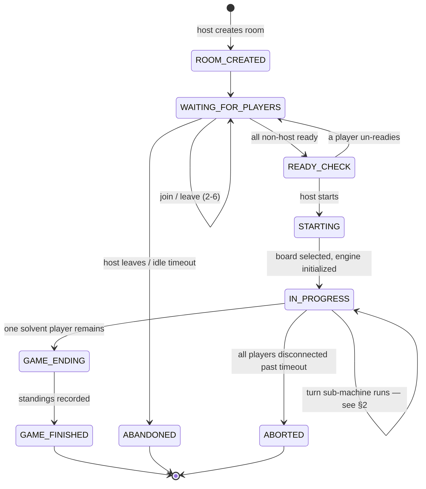
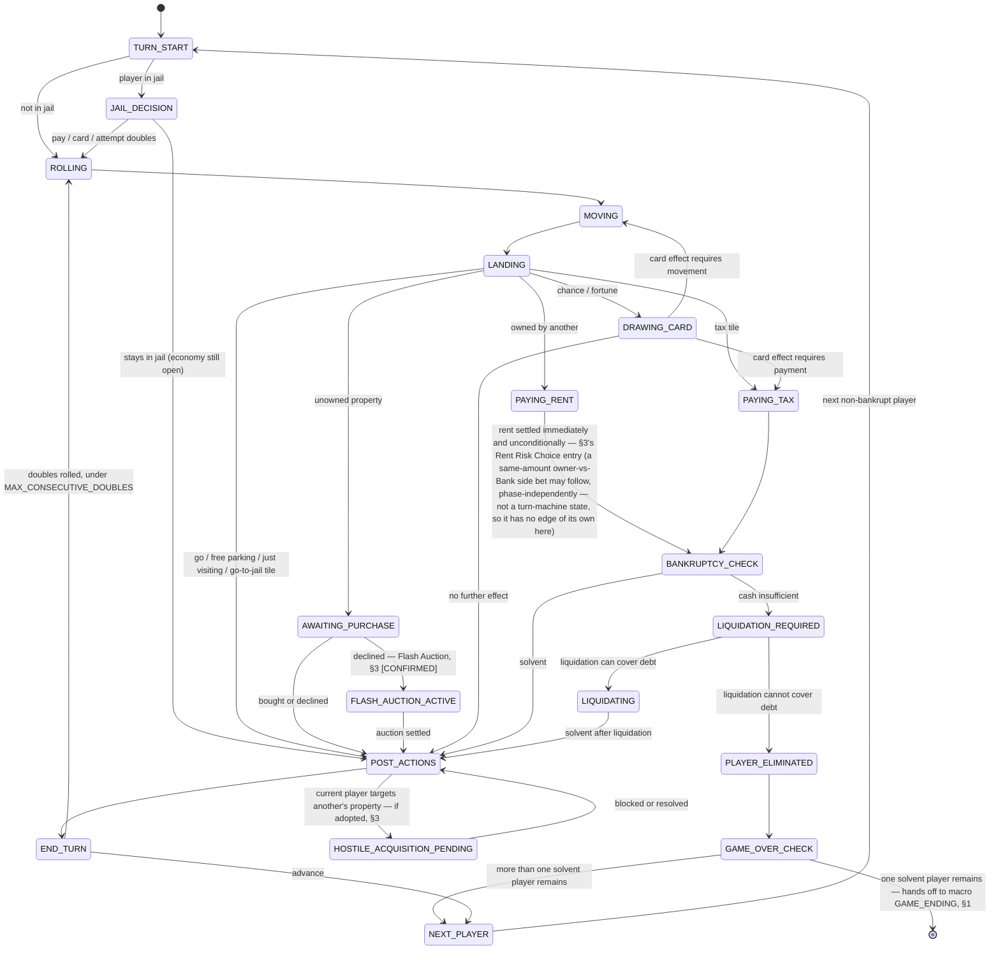

# CoBacTyPhu — Game State Machine Specification

Design only — no code, no database schema, no Socket.IO event catalog in this document, per your instruction. Source of truth for how state transitions work; `GAME_DESIGN_SPEC.md` remains source of truth for the rules those transitions enforce. Same tagging convention as the earlier docs: **[CONFIRMED]**, **[PROPOSED]**, **[OPEN DESIGN DECISION]**.

Two small refinements to earlier docs come out of this pass — both explained where they occur, not silently changed:
- The turn-flow diagram in `GAME_DESIGN_SPEC.md` §5 is **superseded** by §2 below, which is more complete (jail branch, named resolution states instead of one generic bucket, explicit bankruptcy gate, doubles loop).
- The ledger `idempotencyKey` format in `GAME_DESIGN_SPEC.md` §10/§21 (`${gameId}:${turnNumber}:${actionSeq}`) is **simplified** to `${gameId}:${stateVersion}` in §6 below — one monotonic counter does the same job with less machinery.

---

## 0. New timer parameters

Extends the parameter table in `GAME_DESIGN_SPEC.md` §0 — all **[PROPOSED]**, none finalized:

| Name | Proposed value | Applies to |
|---|---|---|
| `ROLL_TIMEOUT_SECONDS` | 20 | `ROLLING` |
| `JAIL_DECISION_TIMEOUT_SECONDS` | 20 | `JAIL_DECISION` |
| `PURCHASE_DECISION_TIMEOUT_SECONDS` | 15 | `AWAITING_PURCHASE` |
| `POST_ACTIONS_TIMEOUT_SECONDS` | 30 | `POST_ACTIONS` |
| `FLASH_AUCTION_WINDOW_SECONDS` | 12 | `FLASH_AUCTION_ACTIVE`, initial window |
| `FLASH_AUCTION_BID_RESET_SECONDS` | 3 | `FLASH_AUCTION_ACTIVE`, extension per new high bid |
| ~~`RENT_RISK_TIMEOUT_SECONDS`~~ | ~~10~~ | ~~`RENT_RISK_DECISION`~~ — this phase no longer exists (§3's Rent Risk Choice entry has the full story: the shipped mechanic was revised 2026-08-25 to no longer block on anything, so nothing about it needs a timer any more) |
| `HOSTILE_ACQUISITION_RESPONSE_TIMEOUT_SECONDS` | 20 | `HOSTILE_ACQUISITION_PENDING` |
| `SOCKET_PING_TIMEOUT_SECONDS` | 20 (Socket.IO default range) | how long a network blip is tolerated before it counts as a real disconnect — see §10 |

---

## 1. Game Lifecycle

| State | Meaning | Status |
|---|---|---|
| `ROOM_CREATED` | Host created the room; instantaneous, no other players yet | **[CONFIRMED]** structural |
| `WAITING_FOR_PLAYERS` | Room open, 2–6 players joining/leaving, not all ready | **[CONFIRMED]** — `GAME_DESIGN_SPEC.md` §4 `Waiting` |
| `READY_CHECK` | All currently-joined non-host players ready; host hasn't started yet | **[CONFIRMED]** — `GAME_DESIGN_SPEC.md` §4 `ReadyCheck` |
| `STARTING` | Host triggered start; server selecting board (Small/Large by count, `ADAPTIVE_BOARD_DESIGN.md`), shuffling turn order, dealing decks, setting balances. Brief, not player-actionable — exists so two near-simultaneous start clicks can't double-initialize | **[PROPOSED]** — new explicit state, was implicit before |
| `IN_PROGRESS` | Turn sub-machine (§2) is running | **[CONFIRMED]** |
| `GAME_ENDING` | Win condition just detected; computing final standings, writing `game_results`. Brief, not player-actionable | **[PROPOSED]** — new explicit state, was implicit in `GAME_DESIGN_SPEC.md` §22 |
| `GAME_FINISHED` | Terminal. Results available via `/api/games/:id/result` | **[CONFIRMED]** |
| `ABANDONED` | Terminal — left from `WAITING_FOR_PLAYERS` (host leaves / idle timeout). No `games` row was ever created | **[CONFIRMED]** — `GAME_DESIGN_SPEC.md` §2 |
| `ABORTED` | Terminal — left from `IN_PROGRESS` (all players disconnected past `ABANDONED_GAME_TIMEOUT_MINUTES`). A `games` row exists; recorded as no-contest, not a win | **[PROPOSED]** — split out from `ABANDONED` because a real match existed and probably deserves its own history record, unlike a room that never started |



---

## 2. Turn Lifecycle

Your example (`PLAYER_TURN → ROLLING → MOVING → LANDING → RESOLVING_TILE → ACTION_REQUIRED → RESOLVING_ACTION → END_TURN → NEXT_PLAYER`) is a good top-level shape, but four things are missing or would lose information if kept generic:

1. **No jail branch.** A player starting their turn in jail doesn't roll-and-move the same way — needs its own decision point before `ROLLING`.
2. **`ACTION_REQUIRED` collapses four different situations that need different timers, different actors, and different validation** — buying a property, paying rent, drawing a card, and paying tax are not interchangeable. Naming them (`AWAITING_PURCHASE`, `PAYING_RENT`, `DRAWING_CARD`, `PAYING_TAX`) means the state itself tells you what's valid, instead of needing a payload field to disambiguate. This is the one place I'd actively push back on the proposed structure rather than just extend it.
3. **No bankruptcy gate.** Rent and tax can bankrupt a player; that has to be checked before the turn can safely proceed to `END_TURN`.
4. **No doubles loop.** The example is linear, always ending at `NEXT_PLAYER` — but rolling doubles means the same player goes again (up to `MAX_CONSECUTIVE_DOUBLES`).

Revised flow:



`GAME_OVER_CHECK` is the one point where this sub-machine hands control back to the macro Game Lifecycle machine (§1) — worth calling out explicitly since it's the only cross-machine edge in the whole design.

---

## 3. Special Gameplay States

**Finalized rules — states are load-bearing, not speculative:**

| Mechanic | Status |
|---|---|
| Property purchase decision (`AWAITING_PURCHASE`) | **[CONFIRMED]** — `GAME_DESIGN_SPEC.md` §10 |
| Rent resolution, standard (`PAYING_RENT`) | **[CONFIRMED]** — §11 |
| Event / Fortune resolution (`DRAWING_CARD`) | **[CONFIRMED]** — §13 |
| Bankruptcy (`BANKRUPTCY_CHECK` / `LIQUIDATION_REQUIRED` / `LIQUIDATING`) | **[CONFIRMED]** — §16 |
| Game Over (`GAME_OVER_CHECK` → `GAME_ENDING`) | **[CONFIRMED]** — §17 |
| Flash Auction (`FLASH_AUCTION_ACTIVE` / `FLASH_AUCTION_SETTLING`) | **[CONFIRMED]** — `BOARD_SPECIFICATION.md` Part 2, V1 "Strategic Denial". Core bidding engine **[IMPLEMENTED]** (`backend/src/engine/auction.js`, `IMPLEMENTATION_PLAN.md` P07-T04); turn-machine/timer/fee-charging wiring not yet built — see below |

**Flash Auction — V1 "Strategic Denial", revised 2026-08-17 (supersedes the same-day V0 design below the fold, not layered alongside it):**
```
AWAITING_PURCHASE --(decline)--> FLASH_AUCTION_ACTIVE --(no new bid for FLASH_AUCTION_BID_RESET_SECONDS)--> FLASH_AUCTION_SETTLING --> POST_ACTIONS
```
Starting the auction costs the initiator a fee — `5%` of the property's base price, clamped to `[$20, $80]`, rounded up within that range (`calculateAuctionFee`). `FLASH_AUCTION_ACTIVE` accepts bids from any player, current-turn or not — including the player who just declined. Bids are **absolute amounts, not increments** (e.g. bidding `700` outright); the opening bid starts at **100% of base price** (changed from V0's `Math.floor(propertyPrice * 0.5)`), and every bid, including the opening one, must strictly exceed the current bid. No funds are deducted while bidding is open, only balance-checked. A bidder may fold (removed from `activeBidders`). **REVISED 2026-09-02**: folding now WITHDRAWS the folder's bids — the winner is recomputed from the append-only bid log restricted to bidders still in, falling back to the best surviving bid or to FAILED if none remains. Previously a fold left `highestBidderId` untouched, so a leader who folded still won and was charged, and `applyBankruptcy` (which folds an eliminated player out of a live auction) could hand the property to a player it had just bankrupted. The bid *history* is still never erased — Near-Miss eligibility is about who genuinely competed, and a player who bid then folded still did.

`FLASH_AUCTION_SETTLING` resolves one of two ways:
- **FAILED** — no bid ever became the standing high bid. Property remains Bank-owned; the initiator's fee is **not refunded**.
- **SETTLED** — the winner pays their winning bid and receives the property (`REMOVE_MONEY` + `TRANSFER_PROPERTY` intents). Every other bidder is then checked for the **Near-Miss reward**: eligible if they placed `>= 2` bids and their own highest bid was `>= 90%` of the winning bid. Reward = `2%` of the winning premium (`winningBid - basePrice`), floored, capped at `$50`; a reward that floors to `$0` is not paid.

Implemented as a standalone pure engine module — `backend/src/engine/auction.js` (`calculateAuctionFee`/`startAuction`/`placeBid`/`foldBidder`/`resolveAuction`; `InvalidBidError` for rejected bids; 23/23 tests passing). **Not yet wired into `turnMachine.js`**: the actual `AWAITING_PURCHASE` → `FLASH_AUCTION_ACTIVE` transition, the fee-charging transaction (the fee calculation is implemented; actually debiting the initiator is orchestration work, not done), and the `FLASH_AUCTION_WINDOW_SECONDS`/`FLASH_AUCTION_BID_RESET_SECONDS` timer scheduling (§7), remain future work — same standing `dice.js`/`jail.js` had before `turnMachine.js` (P07-T01) wired them into the state machine.

**Still proposed concepts — states are designed below so the machine is ready if adopted, but the mechanics themselves are not yet approved rules** (`BOARD_SPECIFICATION.md` Part 2 introduced these, along with Flash Auction above, as explicitly proposed; the two below remain unresolved):

#### Risk/Reward decision, general pattern — **[PROPOSED mechanic]**
The reusable shape: a single player faces a binary safe-vs-gamble choice, under a short timer, that blocks the whole table until resolved. **Rent Risk Choice** was the first concrete use of this pattern when it shipped 2026-08-21 — its 2026-08-25 revision (immediately below) dropped the blocking-phase-with-timer shape entirely, so this generic pattern currently has no concrete use anywhere in the shipped game; kept here in case a future event-card variant wants it.

#### Rent Risk Choice — **[CONFIRMED, shipped 2026-08-21]** — revised 2026-08-25, no longer uses any state-machine states in this document

`BOARD_SPECIFICATION.md`'s own Rent Risk Choice entry is the authoritative record of what shipped and why it later changed — summary for this document's purposes only. The original design entered a blocking `RENT_RISK_DECISION` phase (struck through below — this phase no longer exists anywhere in the codebase) that held up the payer, and the rest of the table, until the owner chose Standard or Gamble — with the *payer's* liability (0x, 1x, or 2x) depending on that choice. A real user report identified this as wrong: the payer should only ever owe the fixed standard rent, and should never wait on someone else's decision to find out what they owe.

The revision settles rent immediately and unconditionally in `PAYING_RENT` (§2/§4/§8), the same instant the payer lands — no new state, no timer, nothing blocks. Only *after* that (and only if the rent was paid in cash, not deferred to `LIQUIDATION_REQUIRED`) does a `pendingRentGamble` open, letting the owner optionally risk the amount they already collected against the **Bank**, whenever they like — phase-independent, not turn-scoped, no timeout, no default-on-silence. Because it no longer gates a turn-machine phase transition, it has no states of its own any more: no row belongs to it in §4 or §8 below, and it's why the generic "Risk/Reward decision" pattern above currently has zero concrete uses.

**No longer applies — kept as a record, per this project's own convention of flagging divergences rather than silently deleting prior text:**
```
PAYING_RENT --(owner has Risk Choice available)--> RENT_RISK_DECISION
RENT_RISK_DECISION --(standard)--> BANKRUPTCY_CHECK
RENT_RISK_DECISION --(gamble)--> RENT_GAMBLE_RESOLVING (server rolls) --> BANKRUPTCY_CHECK
RENT_RISK_DECISION --(timeout)--> defaults to standard, never to gamble — see §5 for why
```

#### Hostile Property Acquisition — **[PROPOSED mechanic; states below are ready if adopted]**
```
POST_ACTIONS --(current player targets another's property)--> HOSTILE_ACQUISITION_PENDING
HOSTILE_ACQUISITION_PENDING --(target pays defense fee)--> POST_ACTIONS, no transfer
HOSTILE_ACQUISITION_PENDING --(target accepts or timeout)--> HOSTILE_ACQUISITION_SETTLING --> POST_ACTIONS, forced transfer applied
```
**Design choice made here, not previously stated**: this is initiated only by the current-turn player, during their own `POST_ACTIONS`, the same way a trade proposal would be — not a mid-turn interrupt any player can throw at any time. An any-time interrupt would need a genuinely different (and much more complex) concurrent sub-machine layered across every other state, for a mechanic whose stated purpose (late-game escalation) doesn't need it. Flagging this as a real design decision, not an oversight.

**[OPEN DESIGN DECISION]**, carried over from `BOARD_SPECIFICATION.md`: does `HOSTILE_ACQUISITION_PENDING` timing out mean the target successfully blocked it (safer default), or that the transfer goes through anyway (harsher, arguably more "hostile", but risky for a target who's disconnected rather than deliberately ignoring it)? Both are shown as possible in the outgoing edges above — this needs your call before the mechanic (if adopted at all) can be finalized.

---

## 4. Player Actions per state

`MOVING` and `LANDING` are omitted below — both are instantaneous server-side bookkeeping with no timer and no player action possible while in them.

| State | Who can act | Allowed | Forbidden (notable) | Timeout | Default after timeout | Server validation | Next state(s) |
|---|---|---|---|---|---|---|---|
| `TURN_START` | System | — | everything (transitional) | none | — | — | `JAIL_DECISION` or `ROLLING` |
| `JAIL_DECISION` | Current player | pay fine, use card, attempt roll | roll normally, buy, trade, end turn | `JAIL_DECISION_TIMEOUT_SECONDS` | attempt roll (classic default — don't force a fine payment on someone who didn't choose it) | sender is current player; holds card if using one | `ROLLING` or `END_TURN` |
| `ROLLING` | Current player | roll dice | anything else | `ROLL_TIMEOUT_SECONDS` | roll automatically on their behalf | sender is current player; phase check | `MOVING` |
| `AWAITING_PURCHASE` | Current player | buy, decline | build, trade, mortgage, end turn | `PURCHASE_DECISION_TIMEOUT_SECONDS` | decline | tile unowned; funds check if buying | `POST_ACTIONS` or `FLASH_AUCTION_ACTIVE` |
| `FLASH_AUCTION_ACTIVE` | Any player | bid | end turn, any unrelated action | `FLASH_AUCTION_WINDOW_SECONDS`, extends by `FLASH_AUCTION_BID_RESET_SECONDS` per new high bid | settle with current high bidder, or bank-owned if no bids | `amount > currentHighBid`; `sender.balance >= amount` | `FLASH_AUCTION_SETTLING` |
| `PAYING_RENT` | System (auto) | — | — | none — always instant, unconditionally (revised 2026-08-25, §3) | — | amount server-computed, never client-supplied | `BANKRUPTCY_CHECK` |
| `DRAWING_CARD` | System (auto) | — | — | none — instant | card drawn from server-side deck state | `POST_ACTIONS`, `PAYING_TAX`, or `MOVING` |
| `PAYING_TAX` | System (auto) | — | — | none — instant | amount server-computed | `BANKRUPTCY_CHECK` |
| `BANKRUPTCY_CHECK` | System (auto) | — | — | none — instant | — | compares cash to debt | `POST_ACTIONS`, `LIQUIDATION_REQUIRED` |
| `LIQUIDATION_REQUIRED` | Current player (if player-choice liquidation is adopted — still open, `GAME_DESIGN_SPEC.md` §16) | choose what to sell/mortgage | anything unrelated | **[OPEN]** — no timeout proposed pending that decision | **[OPEN]** | liquidation value + cash re-checked against debt | `LIQUIDATING` or `PLAYER_ELIMINATED` |
| `POST_ACTIONS` | Current player | build, sell house, mortgage, unmortgage, propose trade, initiate hostile acquisition (if adopted), end turn | roll again (unless doubles already granted it), buy unrelated tiles | `POST_ACTIONS_TIMEOUT_SECONDS` | end turn | each sub-action independently validated per `GAME_DESIGN_SPEC.md` §12 | `END_TURN` or `HOSTILE_ACQUISITION_PENDING` |
| `HOSTILE_ACQUISITION_PENDING` | Target player | pay defense fee, accept | anything unrelated | `HOSTILE_ACQUISITION_RESPONSE_TIMEOUT_SECONDS` | **[OPEN — see §3]** | sender is the target; funds check if paying defense fee | `POST_ACTIONS` |
| `END_TURN` | Current player | end turn (or automatic) | anything else | brief, effectively instant once mandatory resolution is clear | advance | no unresolved mandatory payment pending | `ROLLING` (doubles) or `NEXT_PLAYER` |
| `NEXT_PLAYER` | System (auto) | — | — | none — instant | — | skips bankrupt and (per AFK rules) currently-AFK players | `TURN_START` |

---

## 5. Multiplayer Concurrency

- **Two players send actions simultaneously**: not actually simultaneous once they reach the server. Per-room mutation is synchronous (architecture doc §16) — Node's single-threaded event loop processes one, updates in-memory `GameState`, *then* processes the other against the now-updated state. If both targeted the same property, the second sees it already owned and fails ordinary validation — no special "simultaneity" handling is needed because true simultaneity doesn't reach the mutation layer.
- **A player sends an action twice** (double-click, retry): deduped by `clientActionId` — §6.
- **A client sends an old/stale action**: rejected — the action's `lastSeenStateVersion` no longer matches current `stateVersion` where that matters (target-specific actions); returns `STALE_ACTION`.
- **A client sends an action from the wrong state**: rejected outright — §4's per-state allowed-action list *is* the enforcement mechanism; anything not on that state's list returns `PHASE_MISMATCH`. This is the main payoff of naming states explicitly instead of using one generic `ACTION_REQUIRED`.
- **A player disconnects during their turn**: flagged `connected: false`, never removed (`GAME_DESIGN_SPEC.md` §18/§24). Important interaction that wasn't fully spelled out before: **the current state's own timeout (§0 above) always fires on schedule regardless of connection status** — disconnecting doesn't pause `ROLLING`'s 20 seconds. Separately and independently, the reconnect/AFK system (§17/§25 of the Game Design Spec) tracks whether this keeps happening across turns. The two systems don't need to coordinate: the state timeout guarantees the game never stalls; the AFK counter is just watching a pattern over time.
- **A player reconnects**: standard flow (`GAME_DESIGN_SPEC.md` §23) — full state resync, `connected: true`, cancel any pending AFK mark. If they make it back before the current state's own timeout fires, they act normally as if nothing happened; no bonus time is granted for having been away.
- **A player disconnects during Flash Auction**: the auction does not pause — other bidders are actively participating, and freezing a live multi-party auction for one absent bidder would be worse for everyone else. They simply can't bid until they reconnect, same as any other real-time action they'd miss.
- **A player disconnects during a Risk/Reward decision**: no longer a real scenario for the one mechanic (Rent Risk Choice) this used to describe — its 2026-08-25 revision (§3) removed the blocking phase entirely, so there is nothing left for anyone else to be blocked on if the owner disconnects; they simply act on the standing `pendingRentGamble` whenever they reconnect, the same as any other phase-independent action. Kept here, un-renamed, for whatever future mechanic might actually adopt the general Risk/Reward pattern (§3) and reintroduce a real blocking instance of this scenario — the reasoning (default-on-timeout should always be the safe option, never resolve a gamble on someone's behalf while they can't respond) still applies whenever that happens.
- **A player disconnects during a transaction**: a non-event by design. "Transaction" here means a ledger write — a server-computed, atomically-applied operation with no client round-trip in the middle (§16 of the architecture doc: mutate synchronously, persist after). There's no window during which a disconnect could interrupt one.

---

## 6. Action Idempotency

Three distinct concerns, three distinct mechanisms:

1. **True duplicate submission** (double-click, a network layer retrying the same request): every client→server action carries a client-generated `clientActionId` (UUID). Server keeps a short-lived per-socket cache of recently-processed ids (**[PROPOSED]** last ~60 seconds); a repeat is a no-op — server re-acknowledges without reapplying.
2. **Stale context**: every applied action increments one monotonic `stateVersion` counter, scoped per game. Every `game:state_update` broadcast carries the current `stateVersion`. Actions whose validity depends on a specific target's current condition (buy, build, mortgage, respond-to-trade) include the `stateVersion` the client last observed; a mismatch against the server's current value returns `STALE_ACTION` for that action type. Actions that don't depend on a specific target's state (roll, end-turn) don't need this check — turn-ownership + phase checks already cover them.
3. **Reconnect replay**: reconnect (`room:join` with a known `roomId`, per `GAME_DESIGN_SPEC.md` §23) *only* triggers a fresh state resync — it never replays a queue of pending client actions. The client must not locally buffer an action across a disconnect and auto-resend it on reconnect; if a submission's acknowledgment never arrived before the drop, the correct behavior is to let it drop and let the next `state_update` reveal whether it actually applied, not to resubmit it blindly. This is the rule that keeps reconnection from becoming its own source of duplicate actions.

**Simplified from `GAME_DESIGN_SPEC.md` §10/§21**: the coin-ledger `idempotencyKey` is now `${gameId}:${stateVersion}` instead of `${gameId}:${turnNumber}:${actionSeq}` — `stateVersion` already increments exactly once per successfully-applied action game-wide, so it was already doing the job `turnNumber` + a separate `actionSeq` were doing together, with one fewer moving part.

---

## 7. Timer System

**Core principle, directly from your instruction**: the client never runs an authoritative timer. Every server-side timer, when started, broadcasts an absolute `deadlineAt` timestamp (not a relative "seconds remaining") as part of the relevant state payload. The client renders `deadlineAt − now()` locally for a smooth countdown, but only the server's own scheduled callback firing actually triggers a timeout's default action. If a client's local render hits zero a moment before or after the server does, nothing breaks — the client just shows `0:00` briefly; authority never moves to the client.

- One scheduled timer per room per active timed state — not per-player polling.
- When a server timer fires, it synthesizes that state's documented default action (§4) and runs it through the **same** validation/apply pipeline a real player action would use. There is no separate "timeout code path" that bypasses normal server-authoritative checks.
- Reconnecting does not reset or extend an already-running state timeout (§5) — it only cancels a *pending AFK mark*, which is a different timer entirely (tracked across turns, not within one).
- `SOCKET_PING_TIMEOUT_SECONDS` (§0) governs how long a network blip is tolerated by Socket.IO's own transport before the server even raises a `disconnect` event — very brief losses may never surface as a disconnect at all, which is a separate, lower-level concern from any of the gameplay timers above.

---

## 8. State Transition Table

| Current State | Action | Validation | Next State |
|---|---|---|---|
| `WAITING_FOR_PLAYERS` | `join_room` | room not full, correct code | `WAITING_FOR_PLAYERS` |
| `WAITING_FOR_PLAYERS` | `leave_room` / `kick_player` | sender in room / sender is host | `WAITING_FOR_PLAYERS` |
| `WAITING_FOR_PLAYERS` | `set_ready` | sender in room | `WAITING_FOR_PLAYERS` or `READY_CHECK` (if all now ready) |
| `WAITING_FOR_PLAYERS` | idle timeout | `LOBBY_IDLE_TIMEOUT_MINUTES` elapsed | `ABANDONED` |
| `READY_CHECK` | `set_ready` (un-ready) | sender in room | `WAITING_FOR_PLAYERS` |
| `READY_CHECK` | `start_game` | sender is host; count in [2,6]; all ready | `STARTING` |
| `STARTING` | (system) board selected, engine init | player count → Small/Large | `IN_PROGRESS` |
| `IN_PROGRESS` | (enters) | — | `TURN_START` (turn sub-machine) |
| `TURN_START` | (system) | player in jail? | `JAIL_DECISION` / `ROLLING` |
| `JAIL_DECISION` | `pay_jail_fine` / `use_jail_card` / `attempt_jail_roll` | sender is current player | `ROLLING` |
| `JAIL_DECISION` | timeout or failed 3rd roll attempt | `MAX_JAIL_TURNS` reached | `END_TURN` |
| `ROLLING` | `roll_dice` | sender is current player, phase check | `MOVING` |
| `ROLLING` | timeout | — | server rolls on their behalf → `MOVING` |
| `MOVING` | (system) | — | `LANDING` |
| `LANDING` | (system) | tile type lookup | `AWAITING_PURCHASE` / `PAYING_RENT` / `DRAWING_CARD` / `PAYING_TAX` / `POST_ACTIONS` |
| `AWAITING_PURCHASE` | `buy_property` | tile unowned; funds check | `POST_ACTIONS` |
| `AWAITING_PURCHASE` | `decline_purchase` / timeout | phase check | `POST_ACTIONS` or `FLASH_AUCTION_ACTIVE` (if adopted) |
| `FLASH_AUCTION_ACTIVE` | bid | `amount > currentHigh`; funds check | `FLASH_AUCTION_ACTIVE` (resets window) |
| `FLASH_AUCTION_ACTIVE` | window expires with no new bid | — | `FLASH_AUCTION_SETTLING` → `POST_ACTIONS` |
| `PAYING_RENT` | (system) | — always settles immediately and unconditionally (revised 2026-08-25, §3) | `BANKRUPTCY_CHECK` |
| `DRAWING_CARD` | (system) draw | server-side deck state | `POST_ACTIONS` / `PAYING_TAX` / `MOVING`, per card effect |
| `PAYING_TAX` | (system) | amount server-computed | `BANKRUPTCY_CHECK` |
| `BANKRUPTCY_CHECK` | (system) | cash vs. debt | `POST_ACTIONS` or `LIQUIDATION_REQUIRED` |
| `LIQUIDATION_REQUIRED` | liquidate (auto or player-chosen — open) | liquidation value + cash vs. debt | `LIQUIDATING` or `PLAYER_ELIMINATED` |
| `LIQUIDATING` | (system) applies liquidation | — | `POST_ACTIONS` |
| `PLAYER_ELIMINATED` | (system) | — | `GAME_OVER_CHECK` |
| `GAME_OVER_CHECK` | (system) count solvent players | — | `NEXT_PLAYER` or macro `GAME_ENDING` |
| `POST_ACTIONS` | `build_house` / `sell_house` / `mortgage` / `unmortgage` | per `GAME_DESIGN_SPEC.md` §12 | `POST_ACTIONS` |
| `POST_ACTIONS` | `propose_trade` / `respond_trade` | per architecture doc | `POST_ACTIONS` |
| `POST_ACTIONS` | initiate hostile acquisition (if adopted) | sender is current player | `HOSTILE_ACQUISITION_PENDING` |
| `HOSTILE_ACQUISITION_PENDING` | pay defense fee / accept / timeout | sender is target; funds check | `POST_ACTIONS` |
| `POST_ACTIONS` | `end_turn` / timeout | no mandatory payment pending | `END_TURN` |
| `END_TURN` | (system) | doubles and under cap? | `ROLLING` (same player) or `NEXT_PLAYER` |
| `NEXT_PLAYER` | (system) | skip bankrupt/AFK players | `TURN_START` |
| `IN_PROGRESS` | (system) | all players disconnected past `ABANDONED_GAME_TIMEOUT_MINUTES` | `ABORTED` |
| macro `GAME_ENDING` | (system) standings computed | — | `GAME_FINISHED` |

---

## 9. Recovery

- **Server restart**: unchanged in substance from `GAME_DESIGN_SPEC.md` §20 (snapshot after every `TurnEnd` + bankruptcy + game-over), refined by this document: a snapshot now also records the `stateVersion` at snapshot time, and on restore, the in-memory counter resumes from that value — this is what prevents a post-restore `idempotencyKey` collision with a pre-restore one, now that §6 simplified the key format.
- **Player reconnect**: §5/§6 above; no new mechanism beyond what's already specified.
- **Client refresh**: not a distinct case. A refresh is functionally a fast disconnect-then-reconnect from the server's point of view — the same socket-level `disconnect` and subsequent `room:join` fire, so nothing new needs to be designed for it specifically.
- **Temporary network loss**: also handled by the same disconnect/reconnect path, with one nuance — Socket.IO's own transport has a ping/pong liveness check (`SOCKET_PING_TIMEOUT_SECONDS`, §0); a loss shorter than that window may never surface as a server-side `disconnect` event at all, in which case none of the grace-period/AFK machinery engages because from the server's perspective nothing happened.

---

## Decisions requiring your approval

1. All of §0's new timer values — none are finalized, all currently classic-feeling defaults chosen for a first pass.
2. Hostile Acquisition's timeout default (block vs. forced-through) — carried over from `BOARD_SPECIFICATION.md`, still unresolved.
3. `LIQUIDATION_REQUIRED`'s actor and timeout depend on the still-open auto-liquidate-vs-player-chooses decision from `GAME_DESIGN_SPEC.md` §16 — this document can't finalize that state's row in §4/§8 until that's decided.
4. Whether `POST_ACTIONS_TIMEOUT_SECONDS` should exist at all — classic Monopoly has no such timer; a digital multiplayer version probably wants one for pacing, but it's a genuine tradeoff between thinking time and table pace, not an obvious default.
